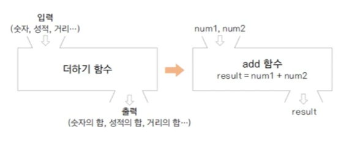
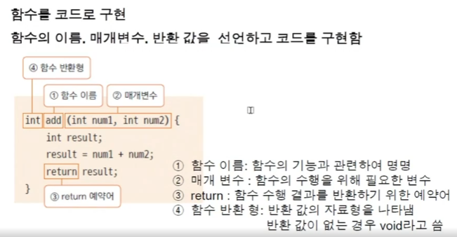
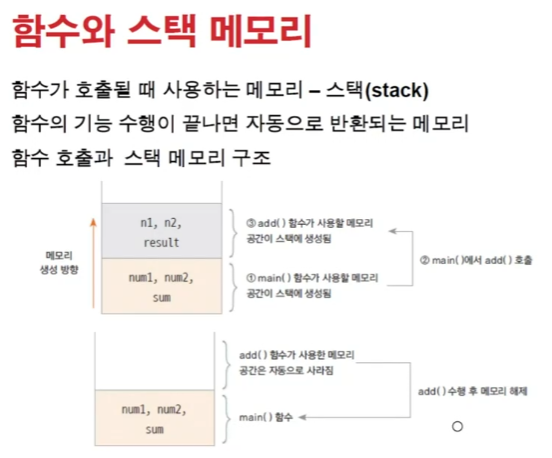
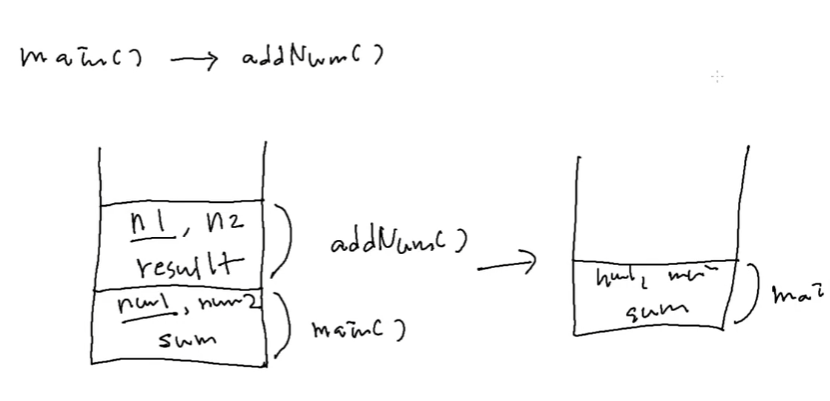

# 1024 [클래스와 객체2]

## 함수
- 하나의 기능을 수행하는 일련의 코드
- 중복되는 기능은 함수로 구현하여 함수를 호출하여 사용함

- 함수가 사용하는 메모리 - stack 메모리
- 공간이 다르니까 이름이 같든 다르던 상관없음 (지역변수들)
- add()함수 끝나면 저절로 메모리가 사라진다.

## 함수 사용 이유
- 함수 기니까 효율적으로 사용하려고, 필요할 때마다 가져다 쓸 수 있도록!
- 한번에 일괄 수정 가능!

## 함수 만들때 주의
- 하나의 기능만 구현하도록