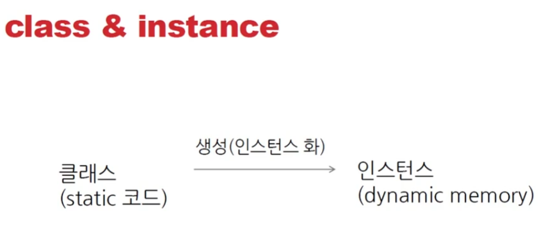
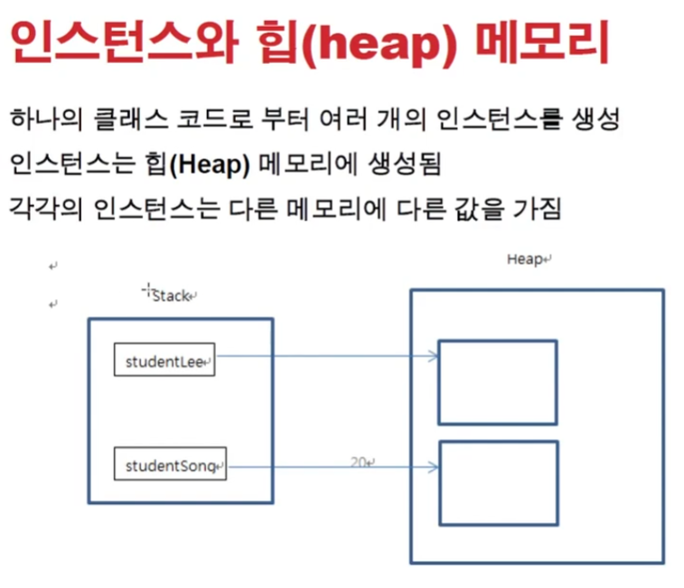
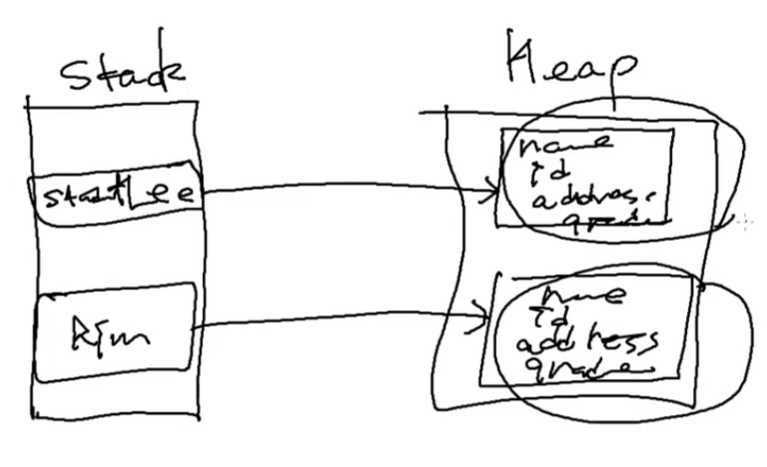
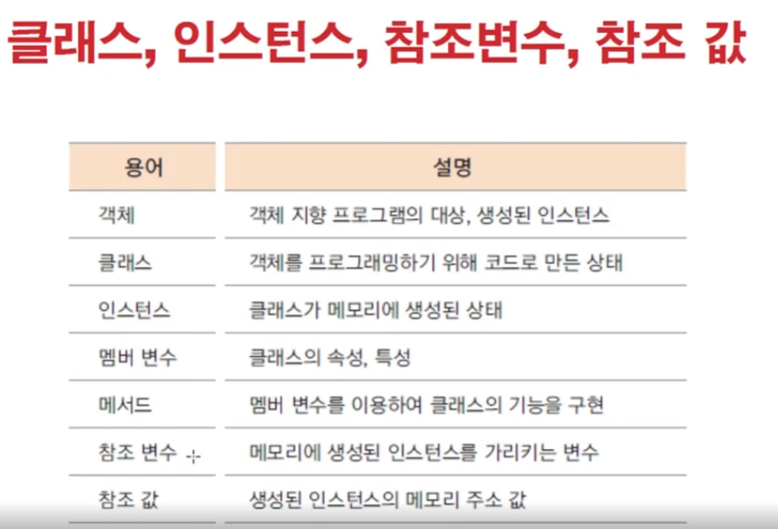
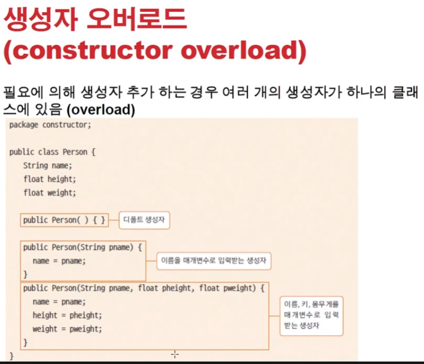

# 1025 [클래스와 객체3]

## 클래스 생성하기

- 클래스를 사용하기 위해서는 클래스를 생성해야함
- new 예약어를 이용하여 클래스 생성
    - 클래스형 변수이름 = new 생성자;
    - ex) Student studentA = new Student();
        - 함수처럼 생겼지만 생성자이다

- 함수, 지역변수 등은 스택메모리에 들어감
    - 스택메모리는 함수끝나면 자동삭제된다
- 인스턴스는 힙메모리에 생성됨
    - 동적으로 생성된다
    - new 라는 키워드로 생성됨
    - 자동으로 없어지지 않고 garbage collector가 삭제해줌

- 각각의 인스턴스들은 힙메모리에 각각 생성된다.
- gc가 삭제해줌

## 생성자 (constructor)

- 생성자 기본문법
    - <modifiers><class_name>([argument_list]){ [<statements]}
    - 생성자는 인스턴스를 초기화할 때의 명령어 집합
    - 생성자의 이름은 그 클래스의 이름과 같음
    - 생성자는 메소드가 아님. 상속되지 않으며, 리턴값이 없음.

