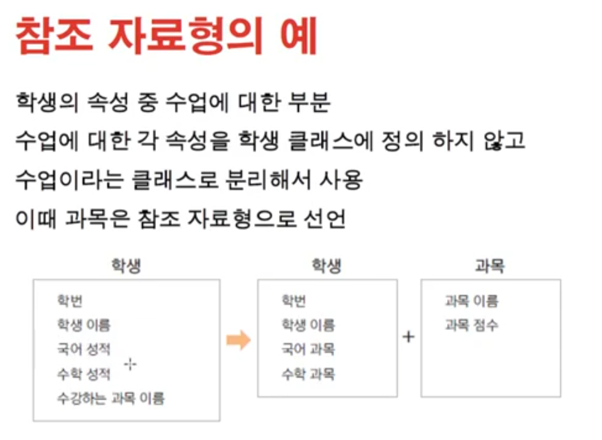

# 1026 [클래스와 객체4]

## 참조 자료형 (reference data type)

- 변수의 자료형
    - 기본자료형
        - int, long, float, double 등
    - 참조자료형
        - String, Date, Student 등
        - jdk에서 가져오는 라이브러리
            - new 하지 않아도 인스턴스 사용할 수 있는 애들이 있음.
            - String..
        - 사용자가 직접 만든 클래스
            - new 해서 인스턴스 사용해야함

- 클래스 분리하기

## 정보은닉 (information hiding)

- private 접근 제어자
    - 클래스의 외부에서 클래스 내부의 멤버변수나 메서드에 접근 하지 못하게 하는 경우 사용
    - 멤버 변수나 메서드를 외부에서 사용하지 못하도록 하여 오류를 줄일 수 있음
    - 변수에 대해서는 필요한 경우 get(), set() 메서드 제공

- 접근제어자
    - public : 어디서나 가능
    - private : 같은 클래스 안에서만 가능
    - default : 같은 패키지 안에서는 가능
    - protected : 상속관계에서만 public으로 사용가능
