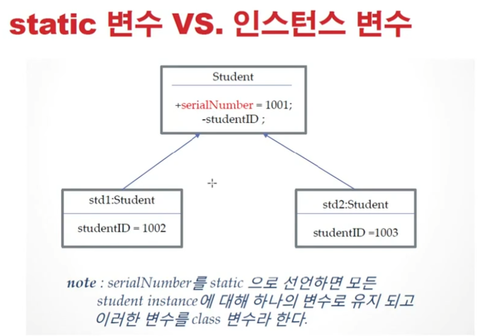
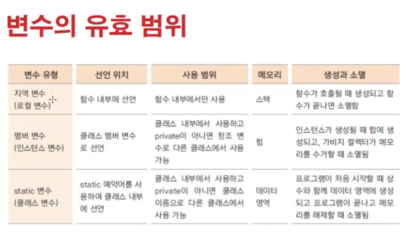

# 1031 [클래스와 객체 7] - static 변수

## static 변수

### static 변수의 정의와 사용 방법

    - static int serialNum;
    - static :  예약어
    - int : 자료형
    - serialNum : 변수이름

- 여러개의 인스턴스가 같은 메모리의 값을 공유하기 위해 사용
- static 변수는 인스턴스가 생성될 때마다 다른 메모리를 가지는 것이 아니라 프로그램이 적제 될 때 데이터 영역의 메모리에 생성 됨
    - 따라서 인스턴스의 생성과 관계없이 클래스 이름으로 직접 참조 함
        - Student.serailNum = 100; // serailNum이 static 변수
        - 클래스 변수라고도 함
        - 멤버변수 = 인스턴스 변수

### 메모리 상에서

- 인스턴스는 heap 메모리 (동적 메모리) - 객체 사용끝이면 소멸하는.
    - new 할때 메모리 할당
- 정적 변수 (정적 메모리,데이터 영역,상수영역)
    - 전체 프로그램이 메모리에 로드될떄(올라올 때)
    - 상수, literal, static 변수 등

### static 변수 VS 인스턴스 변수

### 3종류의 메모리

- 데이터영역 : static, literal..
- 스택메모리 : 지역변수가 사용
- 힙 메모리 : 인스턴스가 사용

### 변수의 유효 범위

