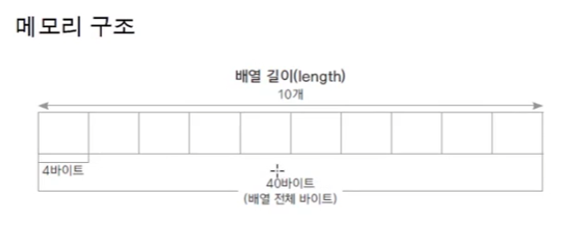
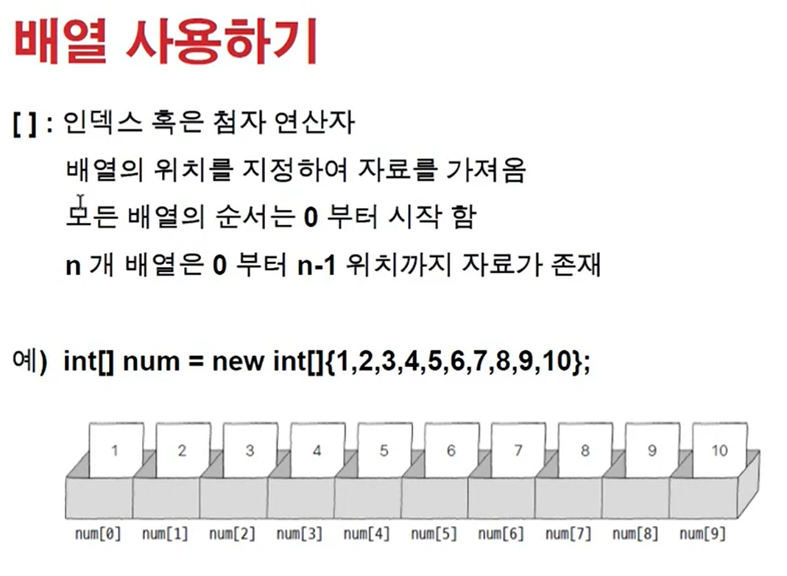
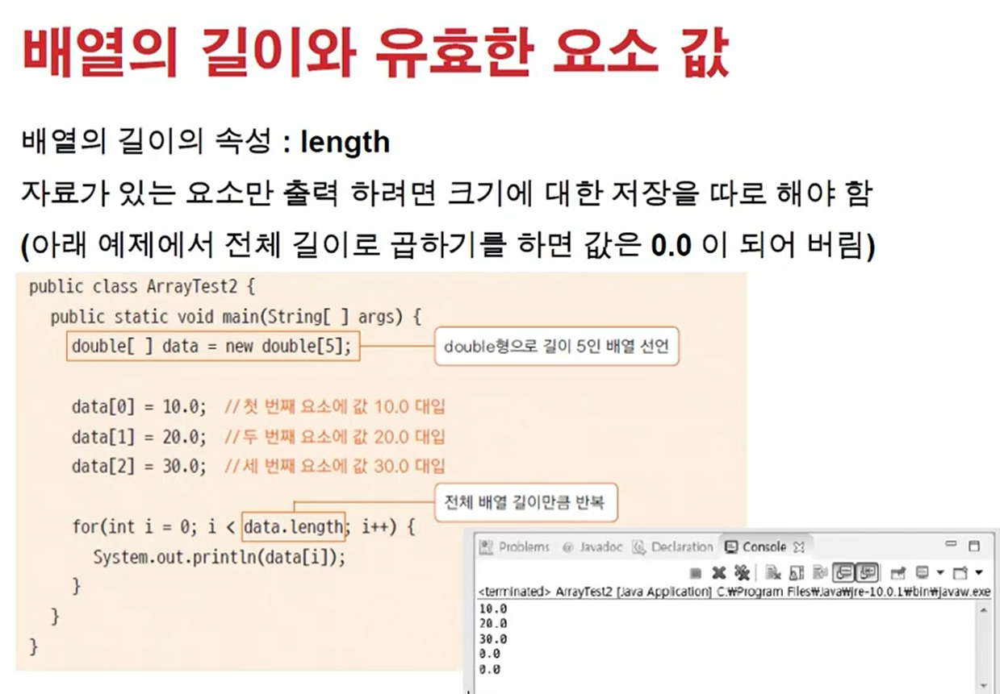
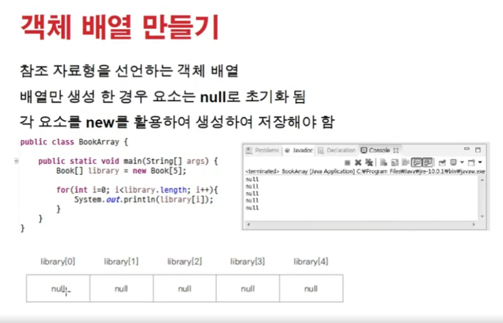
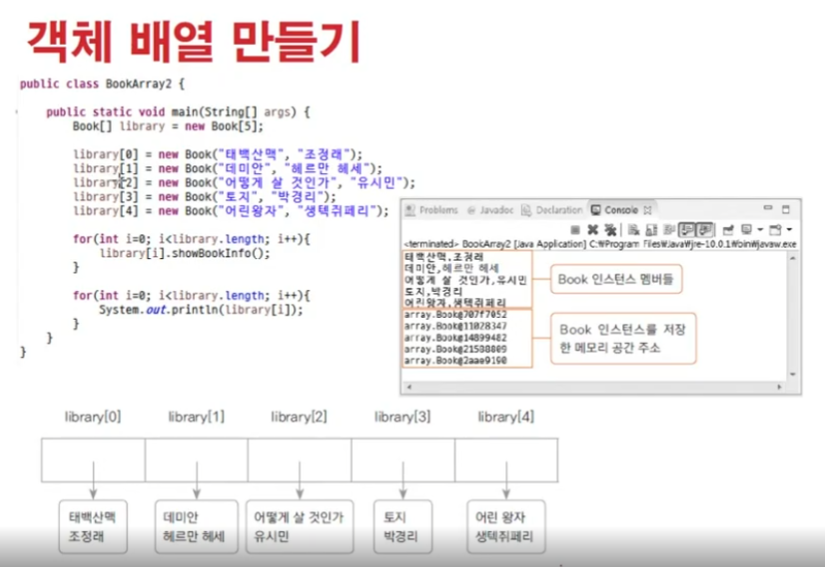
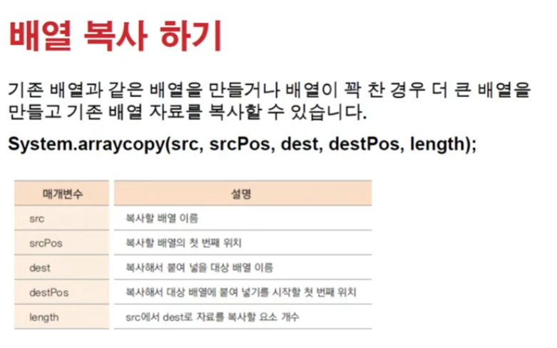
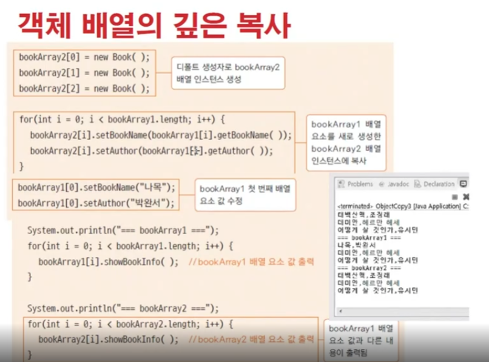
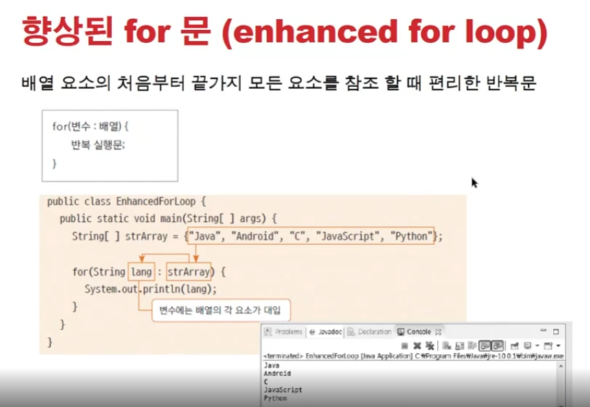

# 1102 [배열과 ArrayList]

## 배열 _ Array

- 동일한 자료형의 변수가 한꺼번에 순차적으로 관리할 수 있는 것
    - 중간에 자료가 비면 안된다
    - 이미 길이를 선언하고 생성된다
    - fixed
    - 연속된 자료구조

- 배열 선언
    - 자료형[] 배열이름 = new 자료형[개수];
        - int [] arr = new int[10];
    - 자료형 배열이름[] = new 자료형[개수];
        - int arr[] = new int[10];

<<<<<<< HEAD
=======

### 기본 자료형의 복사

### 객체 배열 복사

(얇은 복사, 깊은 복사)

