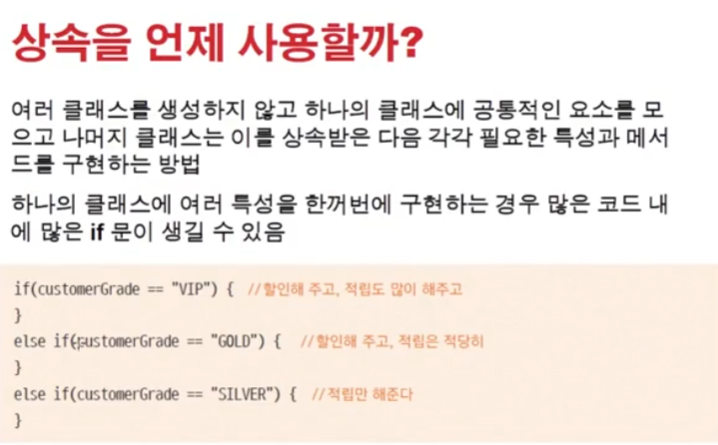
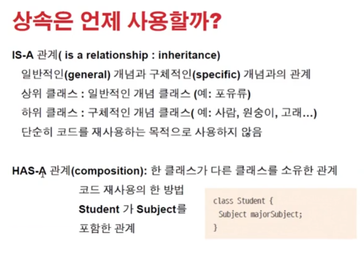
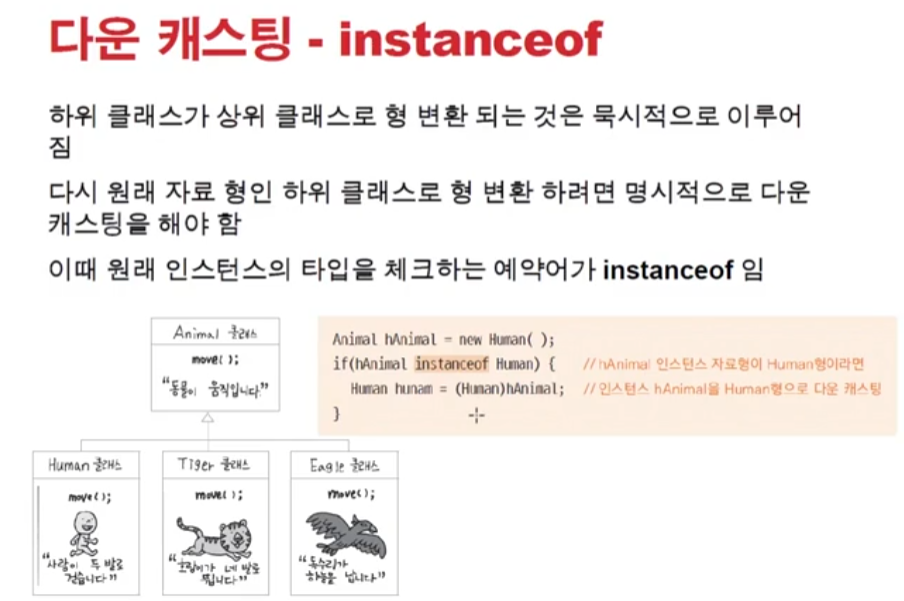

# 1122 [다형성 활용과 다운캐스팅]

## 다형성 활용하기

실제코드에서는 has-a 관계가 많이 쓰인다.

## 다운캐스팅

이미 업캐스팅된걸 굳이 다시 다운캐스팅하는 것은 좋지 않다 할수있으면 override해서 사용하는게 가장 좋다

### instanceof

- 다운캐스팅 할 때 사용된다
    - 안전적인 타입체크
- 상속관계에서 사용할 수 있으면 override쓰는게 더 좋다
- 그런데 overriding으로 해결이 안되면 다운캐스팅을 사용

