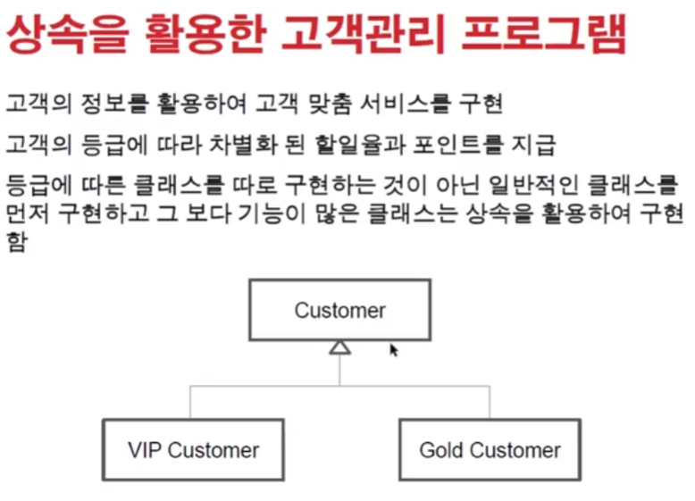
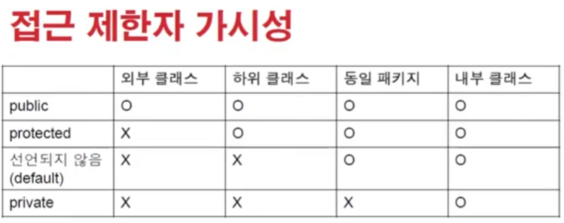
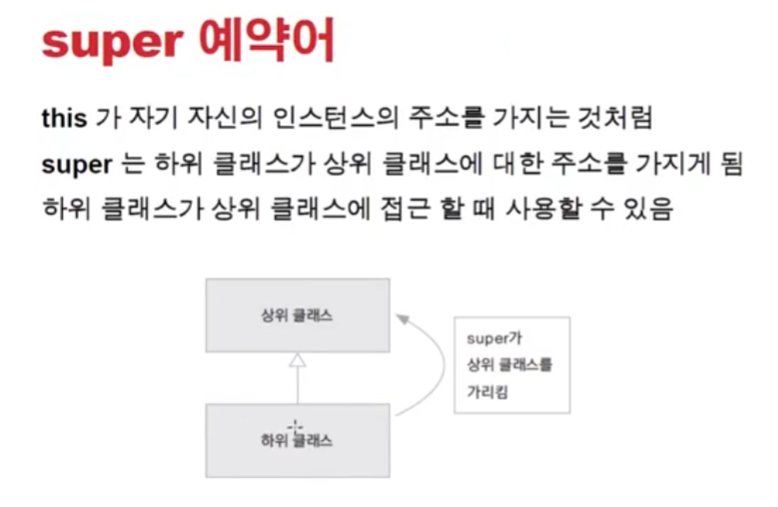

# 1114 [상속과 다형성]

## 상속

- 클래스를 정의 할 때 이미 구현된 클래스를 상속 받아서 속성이나 기능이 확장되는 클래스를 구현함
- 상속하는 클래스
    - 상위클래스, parent class, base class, super class
- 상속받는 클래스
    - 하위클래스, child class, derived class, subclass
- 클래스 상속 문법
    - class B extends A { }

- 상위 클래스는 하위 클래스보다 일반적인 의미를 가짐
- 하위 클래스는 상위 클래스보다 구체적인 의미를 가짐
- extends 뒤에는 단 하나의 class 만 사용 가능-!
- 자바는 single inheritance만을 지원함
- 코드 재사용을 하긴 하는데 재사용을 위해 상속을 사용하는 것은 아니다!

- 예제
    - 

- 접근 제한자 가시성
    - 

- 상속에서의 메모리 상태
    - 

- super() 키워드는 하위클래스가 상위클래스에 접근 할 수 있는 주소값을 가지고 있다
    - 

- 형변환
    - 
    - vip가 customer의 일종이니까
    - vip가 customer를 내포하고 있다