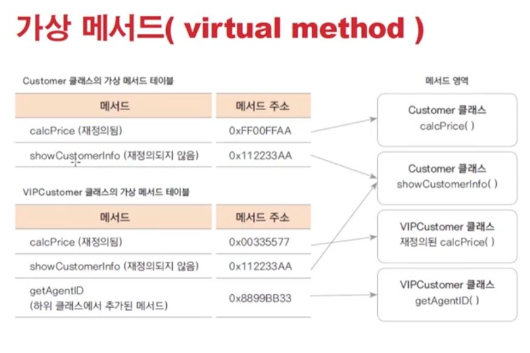
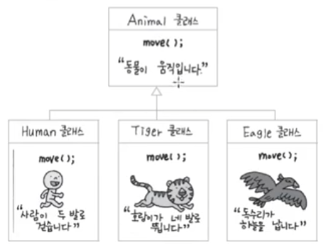
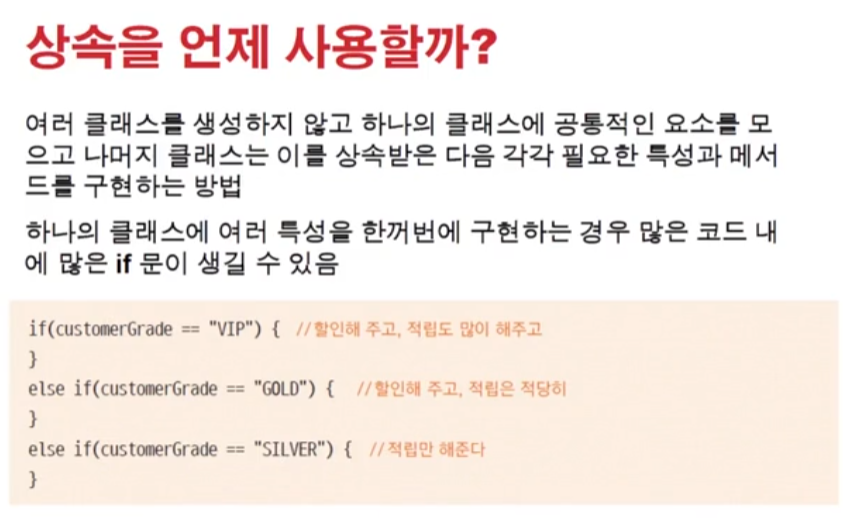

# 1115 [오버라이딩과 다형성]

## 메서드 오버라이딩 (Overriding)

- 상위 클래스에 정의된 메서드 중 하위 클래스와 기능이 맞지 않거나 추가기능이 필요한 경우, 같은 이름과 매개변수로 하위 클래스에서 재정의 함

## 묵시적 형변환과 재정의된 메서드 호출

> Customer vc = new VIPCustomer();
> vc.calcPrice(10000);

## 가상 메서드 (virtual method)

- 자바의 모든 메서드는 가상 메서드
- 프로그램에서 어떤 객체의 변수나 메서드의 참조는 그 타입에 따라 이루어 짐. 가상 메서드의 경우는 타입과 상관없이 실제 생성된 인스턴스의 메서드가 호출되는 원리.
    - 코드의 영역, instuction 영역 - 코드는 항상 같고, 메서드 호출해서 사용하는 메서드는 모두 같은 걸 사용한다. 코드, 메서드 셋의 위치는 같지. 계속 매번 생성되는게 아니니까, 객체처럼.

## 다형성 (polymorphism)

- 다형성 : 하나의 코드가 여러가지 자료형으로 구현되어 실행되는 것
    - 정보은닉, 상속과 더불어 객체지향 프로그래밍의 가장 큰 특징 중 하나
    - 객체지향 프로그래밍의 유연성, 재활용성, 유지보수성에 기본이 되는 특징임
    - // 코드는 한줄인데 어떨때는 이 구현이 불리고, 어떨때는 저 구현이 불리고..

- 다형성 구현하기
    - 하나의 클래스를 상속받은 여러 클래스가 있는 경우
    - 각 클래스 마다 같은 이름의 서로 다른 메서드를 재정의함
    - 상위 클래스 타입으로 선언된 하나의 변수가 여러 인스턴스에 대입되어 다양한 구현을 실행 가능
    - 

- 다형성 활용하기
    - 일반고객, vip고객, gold 고객
    - 5명의 고객을 arrayList에 생성하여 저장하고 각 고객이 물건을 샀을 떄의 가격과 보너스 포인트를 계산함
    - 