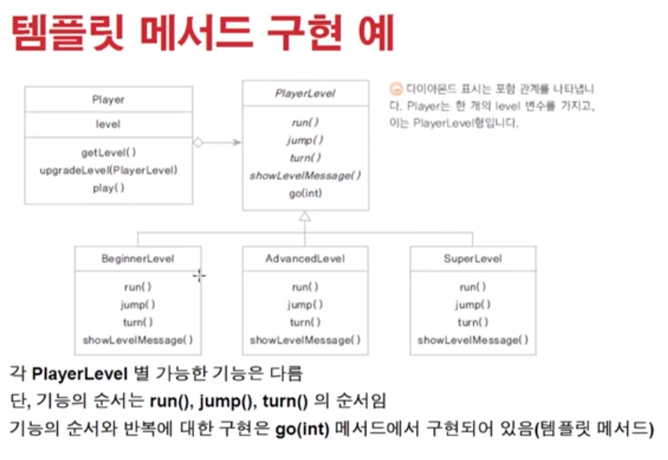

# 1207 [추상클래스와 템플릿 메서드 ]

## 추상클래스와 템플릿 메서드

### 템플릿 메서드

- 추상 메서드나 구현된 메서드를 활용하여 전체 기능의 흐름(시나리오)를 정의하는 메서드
- final로 선언하면 하위클래스에서 재정의할 수 없음
- 프레임워크에서 많이 사용되는 설계 패턴
- 추상클래스로 선언된 상위클래스에 템플릿 메서드를 활용하여 전체적인 흐름을 정의하고 하위클래스에서 다르게 구현되어야 하는 부분은 추상메서드로 선언해서 하위클래스가 구현하도록 함

#### 예제

1. car (ai car, manual car)
2. player Level (beginner, advanced, super)
   

### fianl 예약어

- 자바에서 상수값을 정의할때 public static final int ~~ 이렇게 사용한다고 하면
- 프로그램 로드할때 딱 한번만 생성된다. 프로그램 끝날때까지 상주하는. 