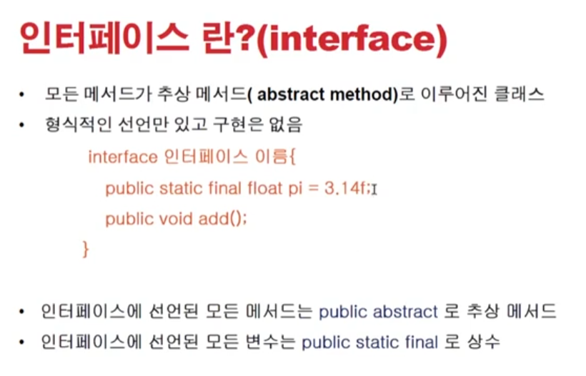
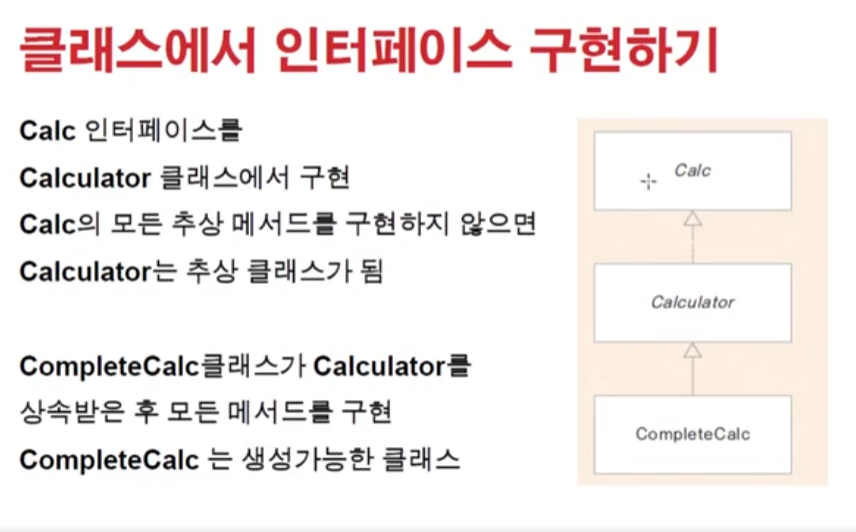
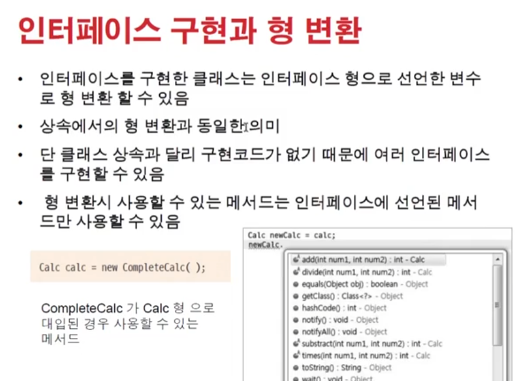
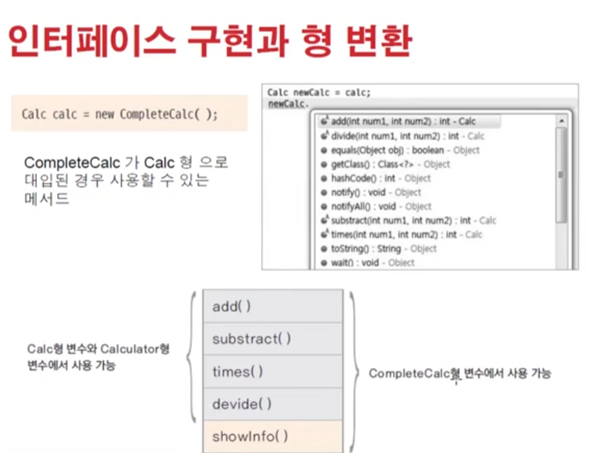
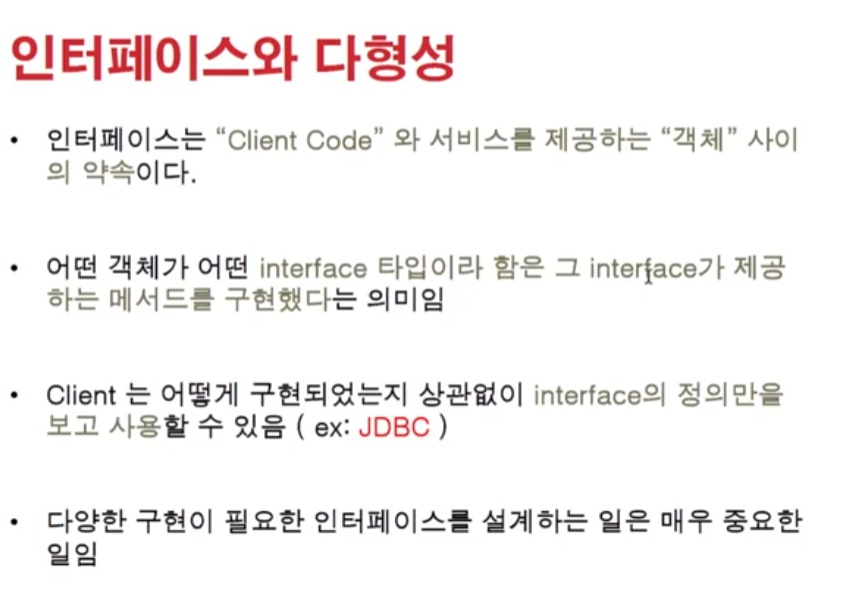
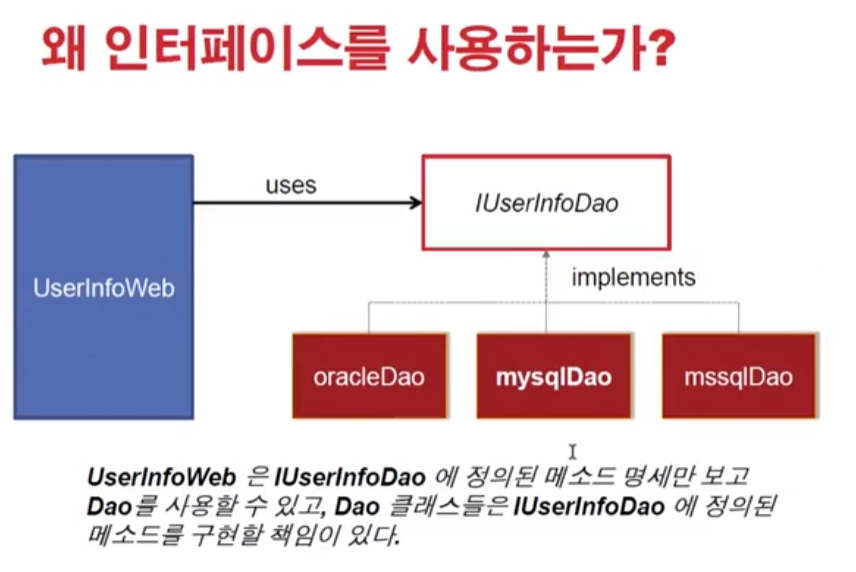
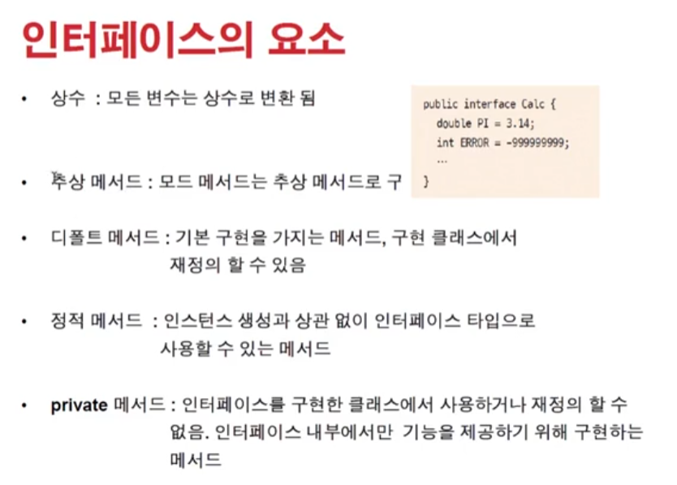

# 1208 [인터페이스 (interface) ]

## 인터페이스

- 클래스처럼 선언된다
- 구현할때 구현코드가 없는 메서드(추상메서드)로만 이루어진다
- 추상클래스는 클래스가 상속받아서 쓰려고 만들어짐 (extends)
- 그렇다면 인터페이스는? (implements)
    - 설계용!
    - ~~이런 코드, 메서드를 만들어야한다- 라고 알려주는.
        - 보통, 웹서버(모듈만들고) - 웹클라이언트(그걸가져다쓰는애)
        - 비슷하게, 인터페이스(전체적 틀만들기) - 클라이언트코드(구현하는애)

- 인터페이스는 구현코드가 없어서 여러 인터페이스 상속가능

