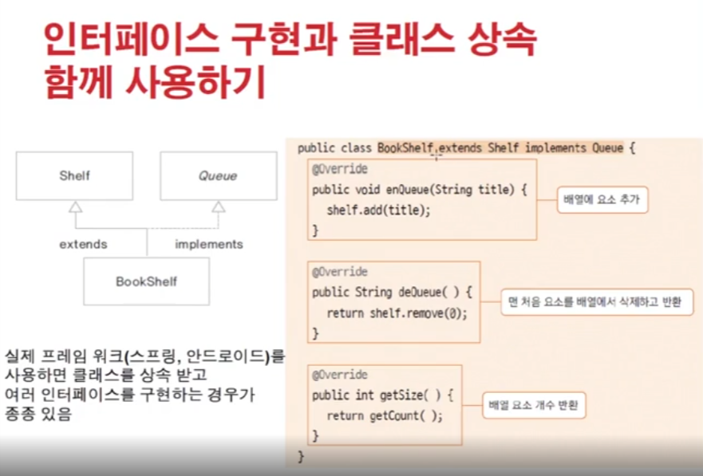

# 1214 [인터페이스 활용]

## 인터페이스의 요소

- 상수 : 모든 변수는 상수로 변환 됨
- 추상 메서드 : 모든 메서드는 추상 메서드로 구현
- 디폴트 메서드 : 기본 구현을 가지는 메서드, 구현 클래스에서 재정의 할 수 있음 => 공통으로 가지는 애들
- 정적 메서드 : 인스턴스 생성과 상관없이 인터페이스 타입으로 사용할 수 있는 메서드
- private 메서드 : 인터페이스를 구현한 클래스에서 사용하거나 재정의 할 수 없음. 인터페이스 내부에서만 기능을 제공하기 위해 구현하는 메서드

## 인터페이스 상속

- 인터페이스 간에도 상속이 가능
- 구현코드의 상속이 아니므로 형 상속(type inheritance)라고 함
- 상속 시, 클래스라면 1개 상속만 가능하지만, 인터페이스는 여러개가 올 수 있음
    - public interface Test implements A, B, C..

## 인터페이스 구현과 클래스 상속 함께 사용

- public class Test extends X implements Y { }