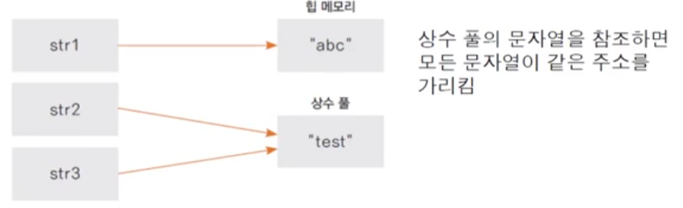
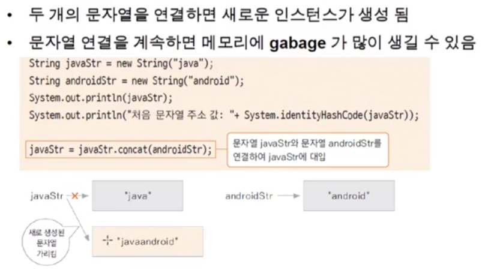
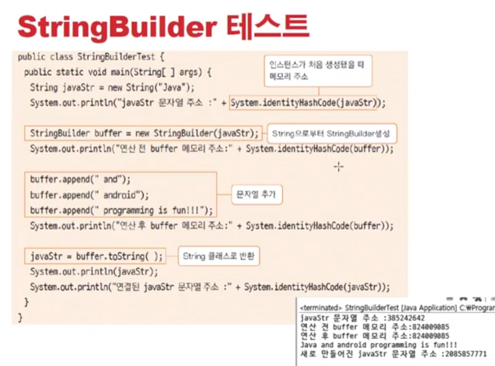
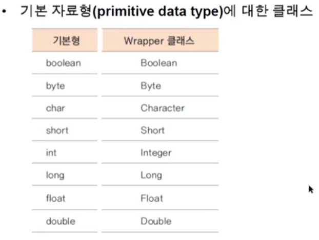
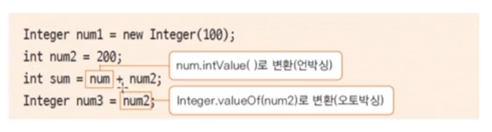
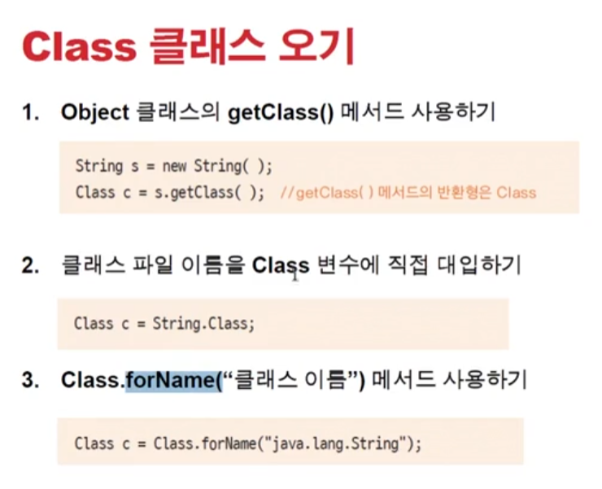

# 0106 [기본클래스 #2]

### String 클래스

- String을 선언하는 두가지 방법
    - String str1 = new String("abc"); // 생성자의 매개변수로 문자열 생성
    - String str2 = "test"; // 문자열 상수를 가리키는 방식
    - 힙 메모리에 인스턴스로 생성되는 경우와 상수 풀(constant pool)에 있는 주소를 참조하는 방법 두가지
      
- 한번 생성된 String 값(문자열)은 불변(immutable) - 선언된 이후에는 변하지 않는다
    - final로 선언되어있음 - 상수
      
- StringBuilder, StringBuffer 사용하기!
    - 내부적으로 가변적인 char[] 배열을 가지고 있는 클래스
    - 문자열을 여러번 연결하거나 변경할 떄 사용하면 유용함
    - 매번 새로 생성하지 않고 기존 배열을 변경하므로 gabage가 생기지 않음
    - StringBuffer는 멀티쓰레드 프로그래밍에서 동기화(sybchronization)을 보장
    - 단일 쓰레드 프로그램에서는 StringBuilder를 사용하기를 권장
    - toString()메서드로 String 반환
      

### Wrapper 클래스

- 기본 자료형 (primitive data type)에 대한 클래스
- 
- 기본형을 감쌌다고 생각해!
- 오토박싱(autoboxing)과 언박싱(unboxing)
    - Integr는 객체이고, int는 4바이트 기본 자료형임
    - 두 개의 자료를 같이 연산할 떄 자동으로 변환이 일어남
      
        - num1은 Integer형인데 3번째줄의 int sum = num + num2로 될때 자동적으로 언박싱이 되어서 int로 변한다
        - 반대로 int가 Integer형으로 넣어질때는 오토박싱이 된다.

### Class 클래스

- 어떤 클래스에 대해서 정보를 알 수 있게 한다
- 자바의 모든 클래스와 인터페이스는 컴파일 후 class 파일로 생성됨
- class 파일에는 객제의 정보 (멤버변수, 메서드, 생성자 등)가 포함되어 있음
- Class 클래스는 컴파일된 class 파일에서 객체의 정보를 가져올 수 있음
- 

#### Class 클래스로 정보 가져오기

- reflection 프로그래밍 : Class 클래스를 이용하여 클래스의 정보(생성자, 멤버변수, 메서드)를 가져오고 이를 활용하며 인스턴스를 생성하고, 메서드를 호출하는 등의 프로그래밍 방식
- 로컬 메모리에 객체가 없어서 객체의 데이터 타입을 직접 알 수 없는 경우(원격에 객체가 있는 경우 등) 객체 정보만을 이용하여 프로그래밍 할 수 있음
- Constructor, Method, Filed 등 java.lang.relfect 패키지에 있는 클래스들을 활용하여 프로그래밍
- 일반적으로 자료형을 알 수 있는 경우에는 사용하지 않음

#### CLass.forName() 메서드로 동적로딩 하기

- 동적로딩 : 컴파일 시 데이터 타입이 모두 binding 되어 자료형이 로딩되는 것 (static loading)이 아니라 실행 중에 데이터 타입을 알고 binding 되는 방식
- 프로그래밍 할 떄는 어떤 클래스를 사용할 지 모를 때 변수로 처리하고 실행될 때 해당 변수에 대입된 값의 클래스가 실행될 수 있도록 Class 클래스에서 제공하는 static 메서드
- 실행 시에 로딩되므로 경우에 따라 다른 클래스가 사용될 수 있어 유용함
- 컴파일 타임에 체크 할 수 없으므로 해당 문자열에 대한 클래스가 없는 경우 예외 (ClassNotFoundException)이 발생할 수 있음
- `String className = "classex.Persion" / Class pClass = Class.forName(className);`