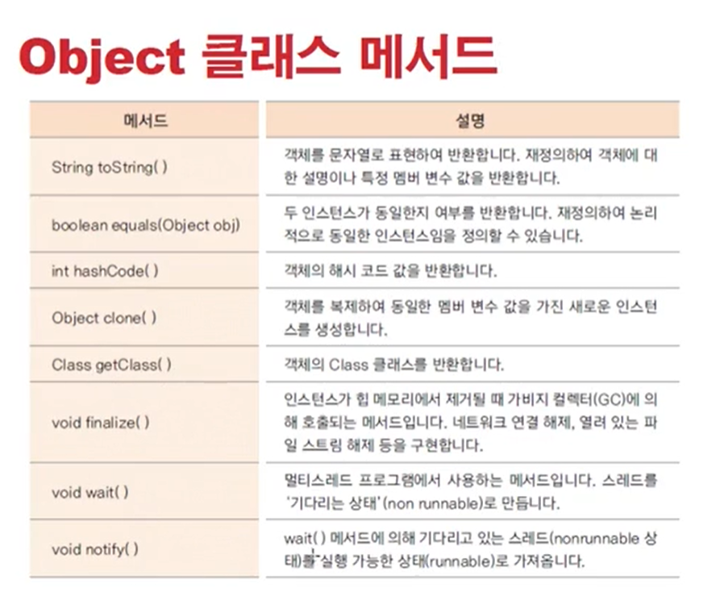
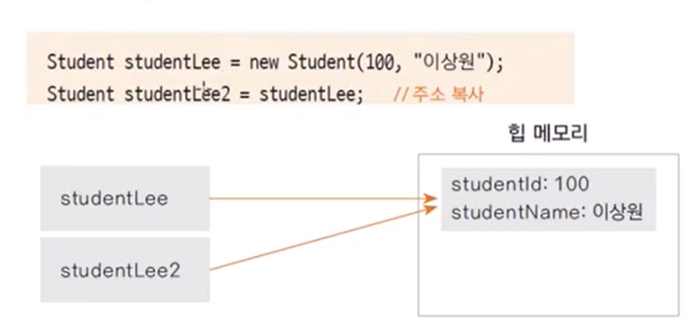

# 0105 [기본클래스 #1]

### java.lang 패키지

- 프로그래밍 시 import 하지 않아도 자동으로 import 됨
    - 프리컴파일 단계에서 자동으로 임포트함
    - import java.lang.*; 문장이 추가됨
- 많이 사용하는 기본 클래스들이 속한 패키지
- String, Integer, System 등

### Object 클래스

- 모든 클래스의 최상위 클래스
- java.lang.Object 클래스
- 모든 클래스는 Object 클래스에서 상속 받음
    - 컴파일러가 extends Object를 추가함
    - 모든 클래스는 Object 클래스의 메서드를 사용할 수 있음
    - 모든 클래스는 Object 클래스의 메서드 중 일부는 재정의 할 수 있음
        - final로 선언된 메서드는 재정의 못함
        - Object 클래스 까보면 몇몇개는 final로 선언되어있음 -> 재정의 X

### Object 클래스의 메서드

1. toString() 메서드
    - Object 클래스의 메서드
    - getClass().getName()+'@'+Integer.toHexString(hashCode()) - 이게 toString의 원형
        - Object.Book -> 클래스이름
        - @16ㄹ65612 -> 해시코드값 = JVM(힙메모리)에 인스턴스가 생성된 위치 주솟값 (16진수)
    - 객체의 정보를 String으로 바꾸어서 사용할 때 많이 쓰임
    - String, Integer 클래스에는 이미 재정의 도어있음
    - String은 문자열 반한
    - Integer는 정수 값 반환

2. equals() 메서드
    - 두 인스턴스의 주솟값을 비교하여 true / false로 반환
    - 재정의하여 두 인스턴스가 논리적으로 동일함의 여부를 반환
    - 같은 학번의 학생인 경우 여러 인스턴스의 주소값은 다르지만, 같은 학생으로 처리해야 학점이나 정보 산출에 문제가 생기지 않으므로 이런 경우 equals()메서드를 재정의함
      

3. hashCode() 메서드
    - hash : 정보를 저장, 검색하기 위해 사용하는 자료 구조
    - 자료의 특정 값(키 값)에 대해 저장 위치를 반환해주는 해시 함수를 사용함
        - index = hash(key)
            - index - 저장위치
            - hash() - 해시함수
            - key - 객체정보
    - 해시함수는 어떤 정보인가에 따라 다르게 구현 됨
    - hashCode()  메서드는 인스턴스의 저장 주소를 반환함
    - 힙 메모리에 인스턴스가 저장되는 방식이 hash
    - hashCode() 의 반환 값 : 자바 가상 머신이 저장한 인스턴스의 주소값을 10진수로 나타냄
    - 서로 다른 메모리의 두 인스턴스가 같다면?
        - 재정의 된 equals()메서드의 값이 true
        - 동일한 hashCode() 반환 값을 가져야함
    - 논리적으로 동일함을 위해 equals()메서드를 재정의하였다면 hashCode()메서드로 재정의 하여 동일한 값이 반환 되도록 함
    - String 클래스 : 동일한 문자열 인스턴스에 대해 동일한 정수가 반환됨
    - Integer 클래스 : 동일한 정수값 인스턴스에 대해 동일한 정수값이 반환됨

4. clone() 메서드
   - 객체의 원본 복제하는데 사용하는 메서드
   - 원본을 유지해 놓고 복사본을 사용할 때
   - 기본 틀(prototype)을 두고 복잡한 생성과정을 반복하지 않고 복제
   - clone()메서드를 사용하면 객체의 정보(멤버변수 값)가 같은 인스턴스가 또 생성되는 것이므로
   객체지향 프로그램의 정보은닉, 객체 보호의 관점에서 위배될 수 있음
   - 객체의 clone()메서드 사용을 허용한다는 의미로 cloneable 인터페이스를 명시해 줌
     - class Test implements Cloneable {}