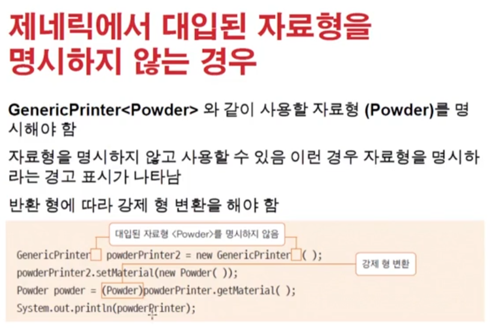

# 0110 [제네릭 프로그래밍]

### 제네릭(Generic) 프로그래밍

- 자바 5.0부터 나옴
- 변수의 선언이나 메서드의 매개변수를 하나의 참조 자료형이 아닌 여러 자료형을 변환 될 수 있도록 프로그래밍 하는 방식
- 실제 사용되는 참조 자료형으로의 변환은 컴파일러가 검증하므로 안정적인 프로그래밍 방식
- 컬렉션 프레임워크에서 많이 사용되고 있음

#### 제네릭 클래스 정의하기

- 여러 참조 자료형으로 대체될 수 있는 부분을 하나의 문자로 표현
- 이 문자를 "자료형 매개변수"라고 함
- T -> Type / E -> Element / V -> value 등으로 자주 사용됨
- -> Object로 썼던 부분을 모두 <T> 라고 하면 된다
    - Object도 사용할 수 있긴하지만 그러면 매번 다운캐스팅 해줘야 함.
- 제네릭을 사용하면 모든 타입이 다 들어갈 수 있음
    - 그렇지만 가끔에 제약이나 제한이 들어가야함. 다 들어가면 안될때!

#### 자료형 매개변수 T

- 꺽쇠 : 다이아몬드 연산자
- type 의미로 T 많이 사용
- static 키워드는 T에 사용 할 수 없음
    - T는 생성될 때 Type이 결정되기 때문
    - static은 인스턴스와 상관없이 메모리를 잡는다
    - 다이아몬드 연산자 내부에서 자료형은 생략 가능함
- `ArrayList<String> list = new ArrayList<>();` => `var list = new ArrayList<String>();`
    - 자료형 추론 (자바 10부터)
- 
- 
- 

#### 제네릭 메서드 활용하기

- 메서드의 매개변수를 자료형 매개변수로 사용하는 경우
- 자료형 매개변수가 하나 이상인 경우
- 제네릭 메서드의 일반 형식
    - `public <자료형 매개변수> 반환형 메서드이름 (자료형 매개변수) {}`
- 
- 