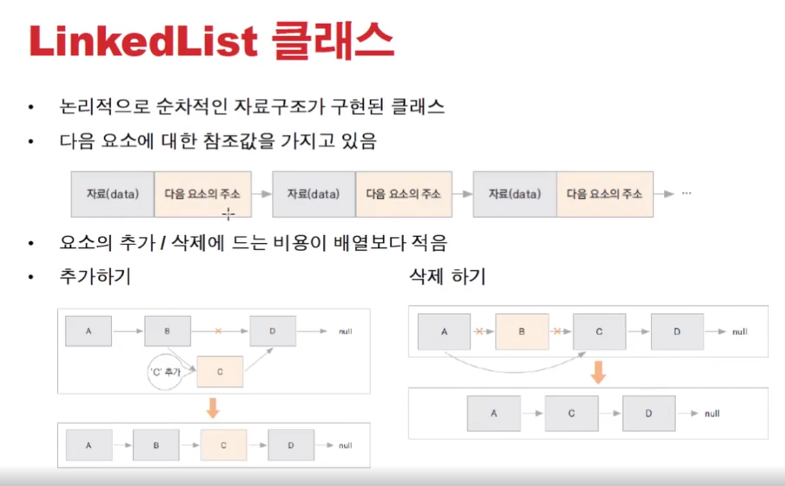

# 0112 [컬렉션 프레임워크 - ArrayList]

## 컬렉션 프레임워크

- 프로그램 구현에 필요한 자료구조 (Data Structure)를 구현해 놓은 라이브러리
- java.util 패키지에 구현되어 있음
- 개발에 소요되는 시간을 절약하면서 최적화 된 알고리즘을 사용할 수 있음
- 여러 인터페이스와 구현 클래스 사용 방법을 이해해야 함
  
- 
    - collection - 하나의 객체 핸들링
        - List는 선형자료구조 - 일렬로 되어있음. 앞뒤의 관계가 1:1 (앞에 1개 뒤에 1개), 순서가 있음
            - stack, queue, List, LinkedList ..
        - Set은 순서가 없고, 집합같은 느낌. 중복 X, 유일한 데이터를 사용. (id같은거 )
            - HashSet, TreeSet
    - map - 쌍으로(key,value) 된 객체 핸들링 - key는 중복 안된다
        - Hashtable / HshMap의 차이는 동기화지원O / 동기화지원X
        - 더 최적한 것은 HashMap!

## List 인터페이스

- Collection 하위 인터페이스
- 객체를 순서에 따라 저장하고 관리하는데 필요한 메서드가 선언된 언터페이스
- 배열의 기능을 구현하기 위한 인터페이스
- ArrayList, Vector, LinkedList 등이 많이 사용 됨

### 쓰레드 관련

- 벡터는 동기화를 지원해준다 (syncronize)
- 그런데 이제 단일스레드 처리할 때 동기화지원하는 vector쓰는건 오버헤드가 된다
- 그러므로 단일스레드일때는 arrayList 쓰고, 멀티스레드 상황일 때는 vector 사용하면 된다.
- 그런데 ArrayList일때 동기화기능 추가되어야 할 경우에는 간단히 코드 수정으로 가능하다!
    - `Collections.synchronizedList(new ArrayList<String>());`