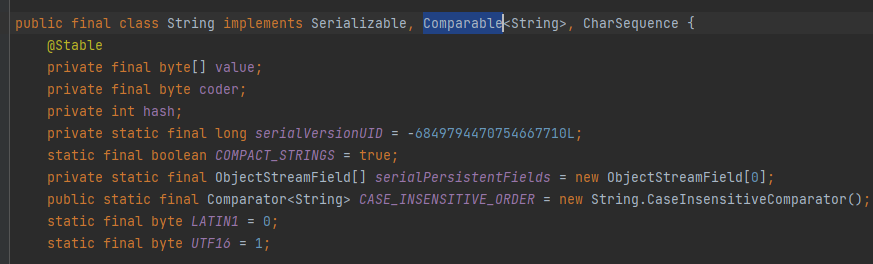
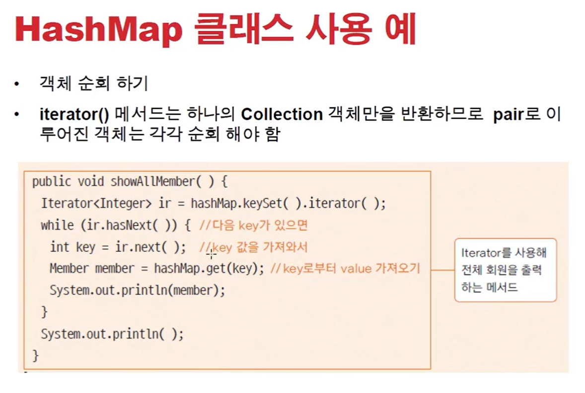
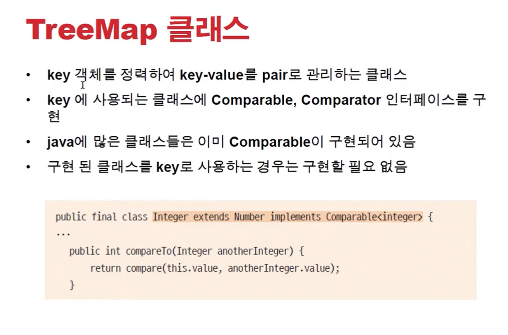

# 0127 [컬렉션 프레임워크 - TreeSet, HashMap, TreeMap]

## TreeSet 클래스

### < TreeSet >

- 객체의 '정렬'에 사용되는 클래스
- 중복을 허용하지 않으면서 오름차순이나 내림차순으로 객체를 정렬함
- 내부적으로 이진검색트리 (binary search tree)로 구현되어 있음
- 이진검색트리에 자료가 저장될 때 비교하여 저장될 위치를 정함
- 객체 비교를 위해 Comparable이나 Comparator 인터페이스를 구현해야 함

- String에는 이미 기본적으로 Comparable이 구현되어있다.

### < Comparable 인터페이스와 Comparator 인터페이스 >

- 정렬 대상이 되는 클래스가 구현해야 하는 인터페이스
- Comparable은 compareTo() 메서드를 구현
    - 매개변수와 객체 자신(this)를 비교
- Comparator는 compare() 메서드를 구현
    - 두 개의 매개변수를 비교
    - TreeSet 생성자에 Comparator가 구현된 객체를 매개변수로 전달
        - `TreeSet<Member> treeSet = new TreeSet<Member>(new Member());`
    - 일반적으로 Comparable을 더 많이 사용
    - 이미 Comparable이 구현된 경우, Comparator를 이용하여 다른 정렬 방식을 정의할 수 있음

## Map 인터페이스

### Map

- key-value pair의 객체를 관리하는데 필요한 메서드가 정의 됨
- key는 중복 될 수 없음
- 검색을 위한 자료 구조
- key를 이용하여 값을 저장하거나 검색, 삭제 할 때 사용하면 편리함
- 내부적으로 hash 방식으로 구현 됨
    - `index = hash(key) // index는 저장위치`
- key가 되는 객체는 객체의 유일성함의 여부를 알기위해 equals()와 hashCode() 메서드를 재정의 함

