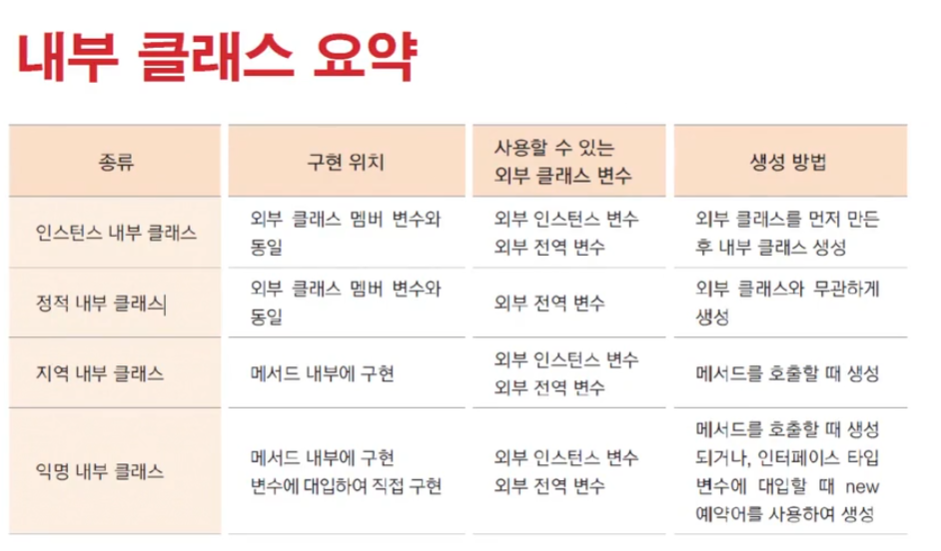
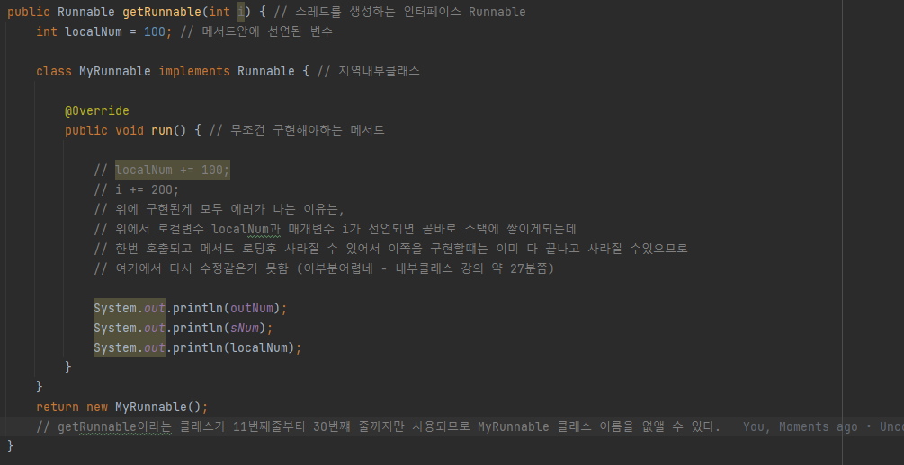
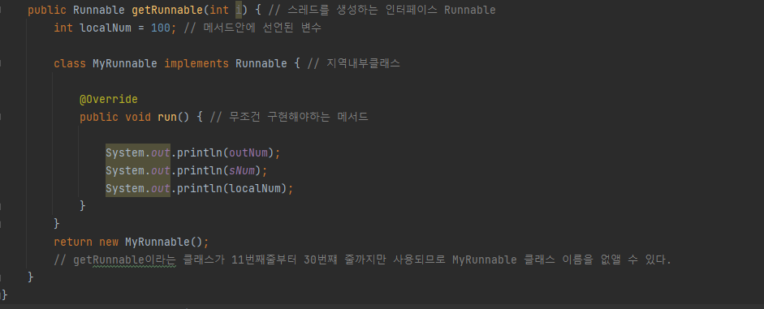
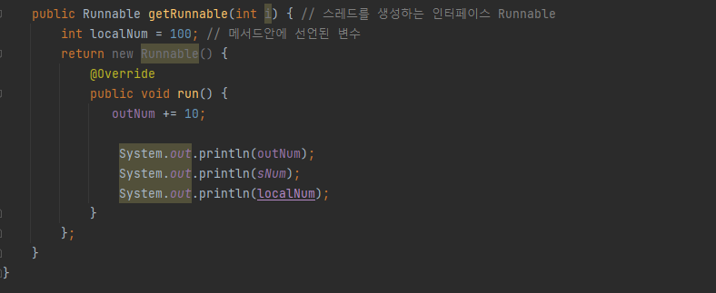
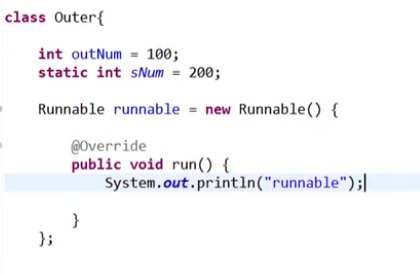

# 0208 [내부클래스]

## 내부클래스

- 클래스 내부에 있는 클래스

- 멤버변수 == 인스턴스 변수
- 인스턴스 내부 클래스, 정적 내부 클래스, 지역 내부 클래스의 위치는 모두 인스턴스 변수와 같다고 생각할 수 있음.

- 설명
  

- getRunnable이라는 클래스가 11번째줄부터 30번쨰 줄까지만 사용되므로 MyRunnable 클래스 이름을 없앨 수 있다.
    - 익명클래스 전 (이름이 있을 때)
      

    - 익명클래스 (이름이 없을 때)
      

- 강의에서의 익명클래스 예제 (anonymous class)
  

- 안드로이드 스튜디오에서 내부에서 스레드 만들떄 이렇게 자주 사용한다.
- 내가 구현하려는 타입을 선언하고 걔에 대한 클래스를 구현하는거기때문에 단 하나의 추상클래스나 인터페이스만을 구현 할 수 있다.
