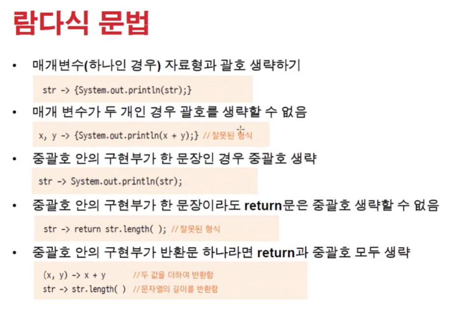
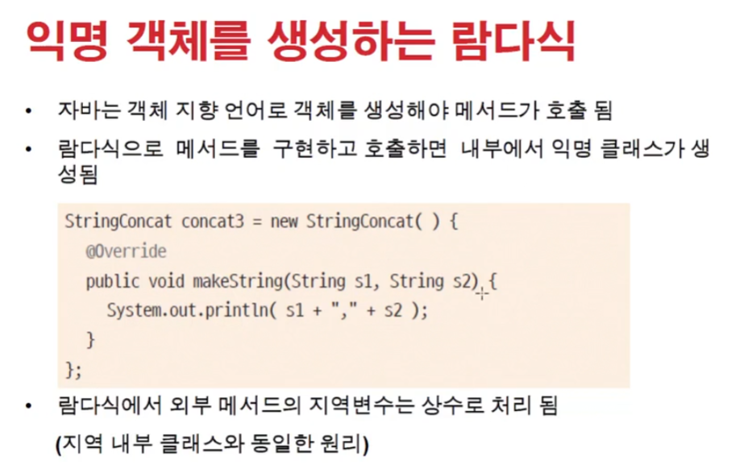
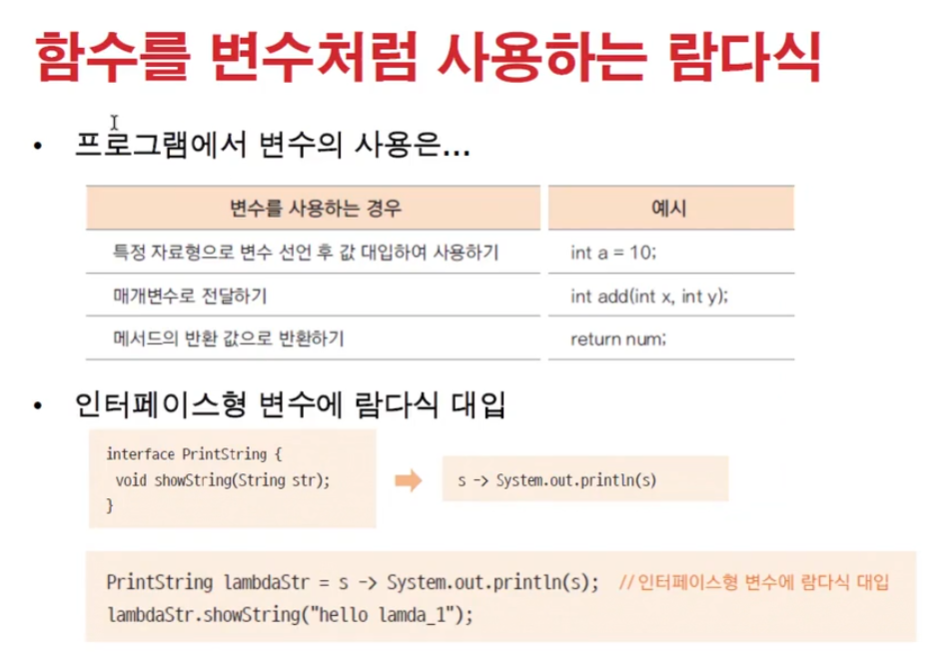

# 0210 [람다식]

## 람다식 (lambda expression)

- FPE - 함수형 프로그래밍
- 자바 8부터 지원
- 클래스를 생성하지 않고 함수의 호출만으로 기능을 수행

### 함수형 프로그래밍 (=FP)

- 순수 함수(pure function)를 구현하고 호출함으로써 외부 자료에 부수적인 영향을 주지 않고 매개변수만을 사용하도록 만든함수
- 함수를 기반으로 구현
- 입력 받은 자료를 기반으로 수행되고 외부에 영향을 미치지 않으므로 병렬처리등에 가능
- 안정적인 확장성 있는 프로그래밍 방식

### 람다식 구현하기

- 익명함수 만들기
- 매개변수와 매개변수를 활용한 실행문으루 구현 `(매개변수)->{실행문;}`
- 두 수를 입력 받아 더하는 add() 함수
    - `int add(int x, int y) { return x + y;}` => `(int x, int y) -> { return x + y;}`
- 함수 이름 반환 형을 없애고 -> 를 사용
- {} 까지 실행문을 의미
- 

### 함수형 인터페이스

- 람다식을 선언하기 위한 인터페이스
- 익명 함수와 매개변수만으로 구현되므로 단 하나의 메서드만을 가져야 함 (두개 이상의 메서드인 경우 어떤 메서드의 호출인지 모호해 짐)
- @FunctionallInterface 애노테이션
    - 함수형 인터페이스라는 의미, 여러 개의 메서드를 선언하면 에러남
- 
- 