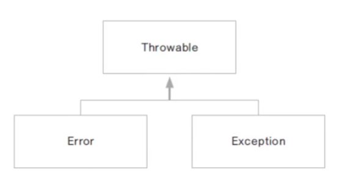
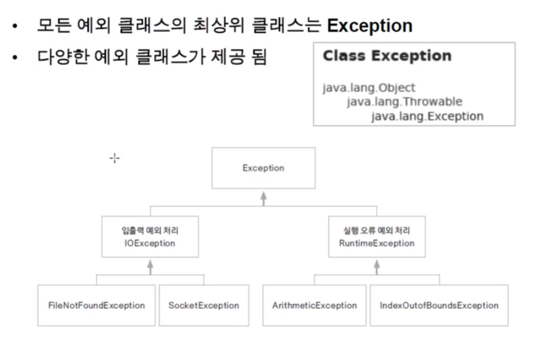
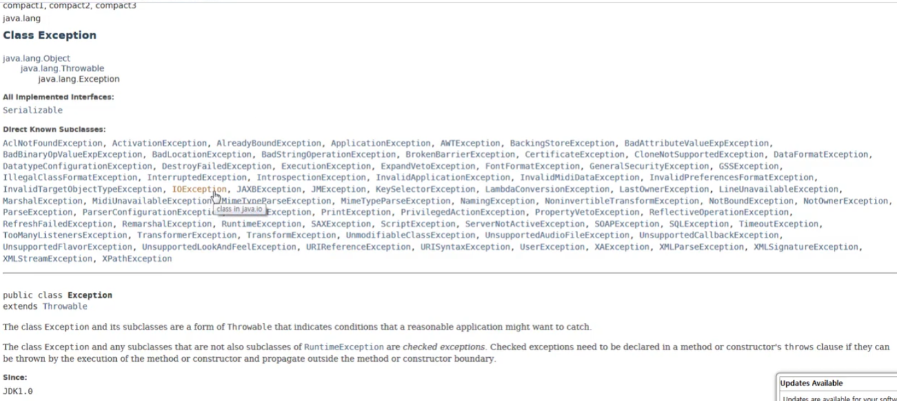
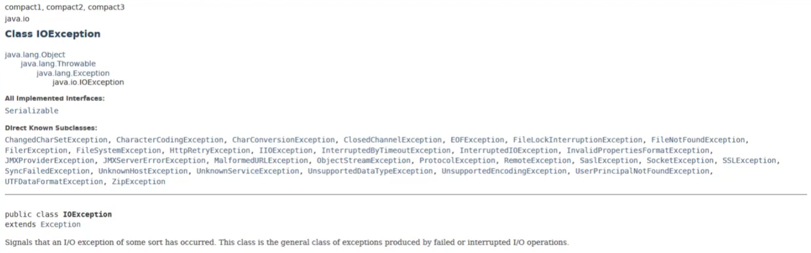
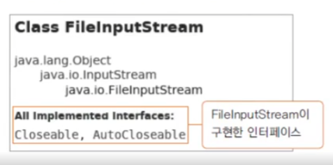
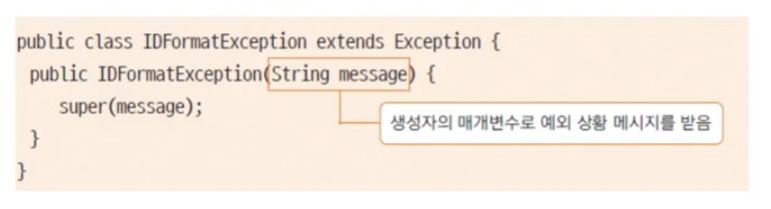

# 0215 [예외처리]

## 오류란?

- 컴파일 오류 (compile error)
    - 프로그램 코드 작성 중 발생하는 문법적 오류
- 실행 오류 (runtime error)
    - 실행 중인 프로그램이 의도 하지 않은 동작을 하거나(bug) 프로그램이 중지되는 오류
- 실행 오류 시 비정상 종료는 서비스 운영에 치명적
- 오류가 발생할 수 있는 경우에 로그(log)를 남겨 추후 이를 분석하여 원인을 찾아야 함
- 자바는 예외 처리를 통하여 프로그램의 비정상 종료를 막고 log를 남길 수 있음

## 오류와 예외 클래스

- 시스템 오류 (error)
    - 가상 머신에서 발생, 프로그래머가 처리 할 수 없음
    - 동적메모리 없는 경우, 스택 오버 플로우 등
- 예외 (Exception)
    - 프로그램에서 제어 할 수 있는 경우
    - 읽어들이려는 파일이 조재하지 않는 경우, 네트워크 연결이 끊어진 경우

## 예외 클래스의 종류

- 모든 예외 클래스의 최상위 클래스는 Exception
- 다양한 예외 클래스가 제공 됨

### try-catch-finally 문

- finally 에서 프로그램 리소스를 정리함
- try{} 블럭이 실행되면 finally{} 블록은 항상 실행 됨
- 리소스를 정리하는 코드를 각 블록에서 처리하지 않고 finally에서 처리함

### try-with-resources 문

- 리소스를 자동해제 하도록 제공해주는 구문
- 자바7 부터 제공 됨
- close()를 명시적으로 호출하지 않아도 try{} 블록에서 열린 리소스는 정상적인 경우, 예외 발생한 경우 모두 자동 해제 됨
- 해당 리소스가 AutoCloseable을 구현 해야 함
- FileInputStream의 경우 AutoCloseable을 구현 하고 있음
    - 

## 예외처리 미루기

- throws를 사용하여 예외처리 미루기
- 메서드 선언부에 throws를 추가
- 예외가 발생한 메서드에서 예외처리를 하지않고 이 메서드를 호출한 곳에서 예외처리를 한다는 의미
- main()에서 throws를 사용하면 가상머신에서 처리됨

## 사용자 정의 예외 (Custom Exception)

- JDK에서 제공되는 예외 클래스 외에 사용자가 필요에 의해 예외클래스를 정의하여 사용.
- 기존 JDK 예외 클래스 중 가장 유사한 클래스에서 상속
- 기본적으로 Exception에서 상속해도 됨
    - 