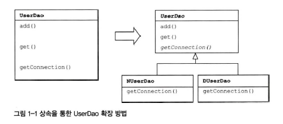

# 1.2 DAO의 분리

## 1.2.1 관심사의 분리

- 개발자는 변화를 대비해야한다 => 분리와 확장을 고려한 설계 필요!

### 관심사의 분리 (separation of Concerns)

- 관심이 같은 것끼리는 하나의 객체 안으로, 친한 객체로 모이게
- 관심이 다른 것은 따로 떨어져서 분리

## 1.2.2 커넥션 만들기의 추출

### (1) UserDao의 관심사항

1. DB와 연결을 위한 커넥션 어떻게 가져올까
2. SQL 문장을 담을 Statement를 만들고 실행하기
    - 파라미터 바인딩
    - sql
3. 사용한 리소스인 Statement, Connection 오브젝트 닫기

### (2) 현재의 UserDao의 문제점

1. 예외상황 처리 없음
2. get(), add() 메소드 모두에 '중복'되어 있는 DB 커넥션 코드

### (3) 중복 코드의 메소드 추출

- 커넥션 가져오는 중복 코드 분리하기
- getConnection() 독립적인 메소드로 생성하기

### (4) 변경사항 검증 : 리팩토링과 테스트

- 리팩토링
    - 외부의 동작방식에는 변화없이 내부 구조를 변경해서 재구성하는 작업
    - 코드 개선 -> 이해도 상승, 변화에 효율적 대응
    - 생산성 향상, 코드 품질 향상, 유지보수 용이

## 1.2.3 DB 커넥션 만들기의 독립

### 상속을 통해 확장하기

- UserDao : 데이터 등록, 조회
- NUserDao, DUserDao : DB 연결

- UserDao 변경 없이 DB 연결 기능을 새로 정의한 클래스 생성 가능
- 새 DB 연결 적용 시 UserDao 상속을 통해 확장만 하면 됨

> UserDao에 팩토리 메소드 패턴을 적용해서 getConnection()을 분리한다

- 디자인 패턴
    - 소프트웨어 설계 시 특정 상황에서 자주 만나는 문제 해결을 위한 재사용 가능한 솔루션
        - 대부분 객체지향 설계에 관함
        - 확장성 추구 방법은 보통 두 가지 방법
            - (1) 클래스 상속
            - (2) 오브젝트 합성

### 템플릿 메소드 패턴 (template method pattern)

- 상속을 통해 슈퍼클래스 기능을 확장 할 떄 사용하는 가장 대표적인 방법
    - 변하지 않는건 슈퍼클래스에, 변하고 확장되는건 서브클래스에.

### 팩토리 메소드 패턴 (factory method pattern)

- 템플릿 메소드 패턴처럼 상속을 통해 기능을 확장하는 패턴 (구조도 비슷)
- 서브클래스에서 구체적인 오브젝트 생성방법을 결정하게 하는 것

### 상속의 한계

- 상속은 간단하고 편리하지만 많은 한계점이 있다.
- 자바는 다중상속 불가능
    - 만약 다른 목적을 위해 이미 상속을 사용하고 있다면?
- 상속을 통한 상하위 클래스 관계는 밀접하다
    - 서브클래스는 슈퍼클래스의 기능을 직접 사용 가능
    - 그러므로 슈퍼클래스의 변경이 있을 시, 서브클래스 또한 함께 수정 필요
- 다른 DAO 클래스가 생성될 시, getConnection() 구현 코드도 매 DAO 클래스마다 중복해서 생성되어야함