# 1.3 DAO의 확장

## 1.3.1 클래스의분리

- 관심사도 분리하고 손쉽게 확장도 하는 방법 알아보자!

### 지금까지 분리한 작업

- (1) 독립된 메소드 만들어서 분리
- (2) 상하위 클래스로 분리
- (3) 상속관계아닌 완전히 독립적인 클래스로 구성

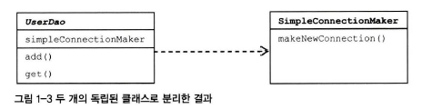

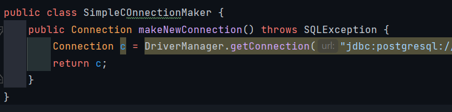

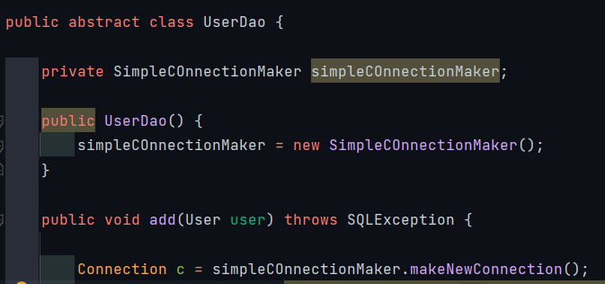

### 이렇게 독립적인 'simpleCOnnectionMaker' 클래스 사용 시 문제점

- (1) simpleCOnnectionMaker 클래스의 makeNewConnection() 메소드를 사용해서 연결했는데 만약 다른 메소드를 연결해야한다면 get(), add() 모든 메소드를 변경해야함.
- (2) db커넥션을 제공하는 클래스가 어떤 것인지 UserDao가 구체적으로 알고있어야한다.
    - UserDao 클래스가 너무 많은 정보를 알고 있어야함

- 이렇게 되면 simpleCOnnectionMaker 라는 특정 클래스에 너무 종속되어진 것

> 어떻게 해야할까?
>
> 해결방법은 바로   두 개의 클래스가 서로 긴밀하게 연결되어있지 않도록 중간에 **'추상적인 연결고리'** 만들어주기!

## 1.3.1 인터페이스의 도입

- 추상화
    - 공통적인 성격을 뽑아내어 이를 따로 분리하는 작업
- 자바의 추상화를 위한 도구
    - '인터페이스'

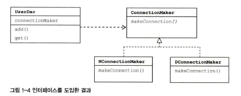

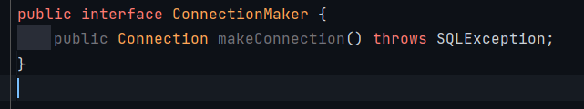

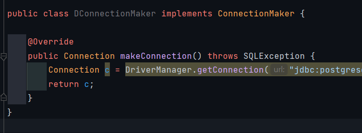

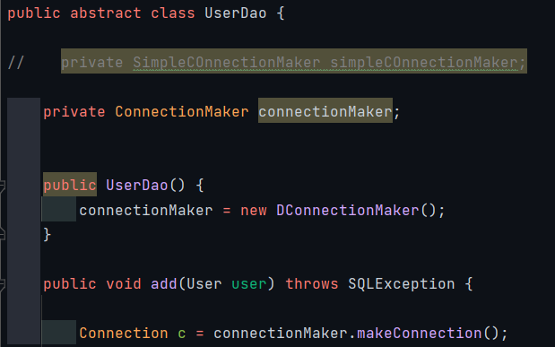

- 'DConnectionMaker' 라는 이름이 노출됨
    - 이렇다는건 매번 UserDao 소스의 생성자 메서드를 필요할 때마다 수정해야한다는 것이다
    - 어떻게 수정없고 확장이 자유로운 코드를 만들 수 있을까?

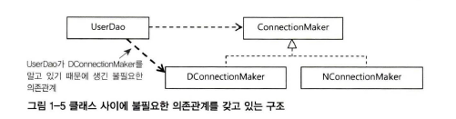

- 실상은 이렇게 UserDao의 수정이 필요한 의존관계가 되었다.

## 1.3.1 관계설정 책임의 분리

### 관계

- 클래스 사이의 관계
    - 코드에 다른 '클래스 이름'이 나타나서 만들어짐
- 오브젝트 사이의 관계
    - 런타임 시 한 쪽이 다른 오브젝트의 레퍼런스를 갖고 있다
    - 코드에서 특정 클래스를 모르더라도, 해당 클래스가 구현한 인터페이스를 사용했다면 그 클래스의 오브젝트를 인터페이스 타입으로 받아서 사용 가능 => '다형성'

### 어떻게 수정해야할까?

- 클라이언트는 자기가 UserDao를 사용해야 할 입장이기 때문에,
- UserDao의 세부전략 이라고도 볼 수 있는 ConnectionMaker의 구현 클래스를 선택하고,
- 선택한 클래스의 오브젝트를 생성해서 UserDao와 연결해줄 수 있다

- 즉, 이전 코드에서는 생성자가 자신이 사용할 오브젝트를 직접 만들고, 관계 또한 만들었다면
- 책임과 관심을 '분리'하게 된다면
- UserDao 클라이언트를 생성하여 이 할 일을 클라이언트가 하게 해야한다.
    - 여기 코드에서는 UserDaoTest 클래스가 클라이언트 역할을 한다

### 수정한 코드

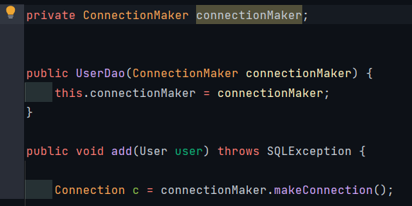

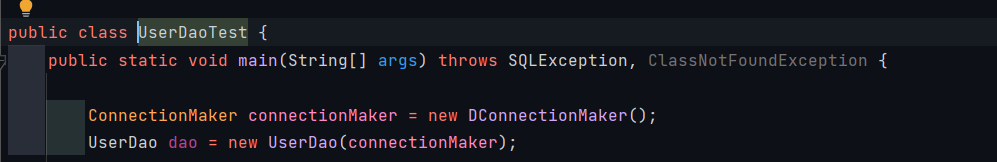

1. UserDao의 생성자에서 ConnectionMaker의 오브젝트르 전달받을 수 있도록 파라미터를 하나 추가
2. ConnectionMaker 생성 시 특정 구현 클래스를 결정한다.
3. 그리고 UserDao 생성 시에도 사용할 connectionMaker을 제공한다

- 이렇게 함으로써 두 오브젝트 사이의 의존관계 설정 효과

### 구조

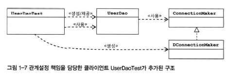

1. 먼저 UserDaoTest는 UserDao가 실제로 사용할 DConnectionMaker 오브젝트 생성
    - `ConnectionMaker connectionMaker = new DConnectionMaker();`
2. UserDao 오브젝트를 생성하면서 생성자를 통해 DConnectionMaker 오브젝트 전달
    - `UserDao dao = new UserDao(connectionMaker);`
3. UserDao는 생성자를 통해 전달받아서 인스턴스 변수에 저장해둔 DConnectionMaker 오브젝트의 makeConnection() 메소드 호출해서 DB 커넥션 생성
    - `public UserDao(ConnectionMaker connectionMaker) { this.connectionMaker = connectionMaker; }`

## 1.3.4 원칙과패턴

- 개방 폐쇄 원칙 (OCP-open closed pirinciple)을 이용해서 지금까지 해온 리팩토링 작업 특징과 최종 코드 장점 정리해보자

### (1) 개방 폐쇄 원칙

- 깔끔한 설계를 위한 객체지향 설계 원칙 중 하나
- 클래스나 모듈은 확장에는 열려 있어야 하고 변경에는 닫혀 있어야 한다
    - 예) UserDao 핵심 코드는 변화에 영향없이 얼마든지 기능 확장 가능

#### SOLID (객체 지향 설계 원칙)

- 객체 지향 프로그래밍 언어 종류 다양, 적용 기법과 관점도 다양
- 특징 (가이드라인)이 있음
- 디자인 패턴 - 특별한 상황에서 발생하는 문제에 대한 좀 더 구체적인 솔루션
- 객체지향 설계 원칙 - 좀 더 일반적인 상황에서 적용 가능한 설계 기준

- SRP the single responsibility principle : 단일 책임 원칙
- OCP the open closed principle : 개방 폐쇄 원칙
- LSP the liskov substitution principle : 리스코프 치환 원칙
- ISP The Interface Segregation Principle : 인터페이스 분리 원칙
- DIP The Dependency Inversion Principle : 의존관계 역전 원칙

### (2) 높은 응집도와 낮은 결합도

- 개방 폐쇄 원칙은 높은 응집도와 낮은 결합도라는 원리로도 설명 가능

- 높은 응집도
    - ConnectionMaker를 분리해서 응집도를 높이기

- 낮은 결합도
    - 책임과 관심사가 다른 오브젝트 또는 모듈과는 낮은 결합도, 느슨하게 연결해야함
    - 즉, '간접적인' 형태로 제공, 서로 독립적으로, 구체적으로는 알 수 없도록.

### (3) 전략 패턴 Strategy Pattern

- 현재의 UserDaoTest-UserDao-ConnectionMaker 구조를 디자인 패턴의 시각으로 보면 전략 패턴에 해당함
- 자주 사용되는 디자인 패턴 중 하나
- 개방 폐쇄 원칙의 실현에 가장 잘 들어맞음
- 전략 패턴은 자신의 기능 맥락(context)에서, 필요에 따라 변경이 필요한 부분을 인터페이스를 통해 외부로 분리하고, 이를 구현한 구체적인 클래스를 그때그때 바꿔서 사용할 수 있게 하는 패턴
    - UserDao는 전략 패턴의 컨텍스트에 해당
        - 컨텍스트는 자신의 기능을 수행하는 데 필요한 기능 중에서 변경 가능한, DB 연결 방식이라는 알고리즘을 ConnectionMaker 라는 인터페이스로 정의하고, 이를 구현한 클래스, 즉 전략을
          바꿔가면서 사용할 수 있 게 분리했다.
    - 컨텍스트 (UserDao)를 사용하는 클라이언트(UserDaoTest)는 컨텍스트가 사용할 전략(ConnectionMaker을 구현한 클래스 DConnectionMaker)을 컨텍스트의 생성자 등을 통해
      제공해주는 게 일반적