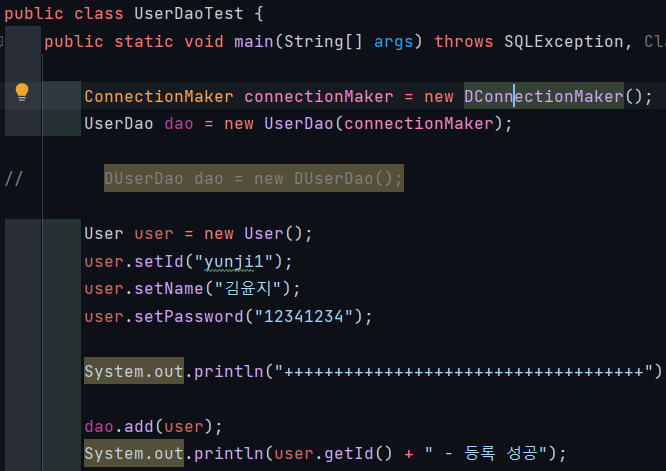
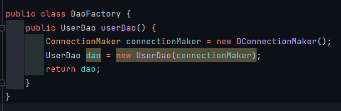
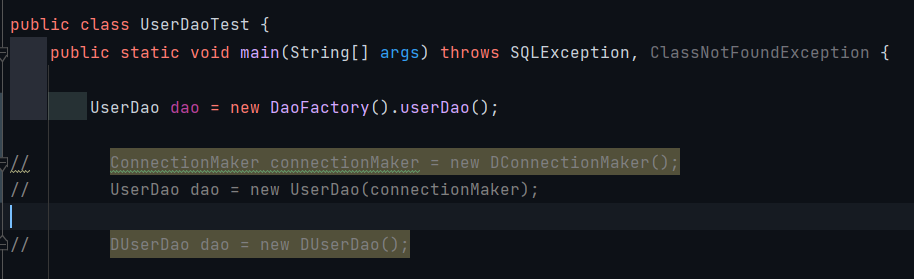
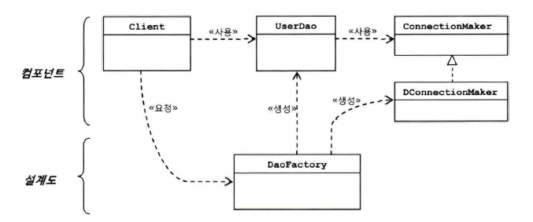
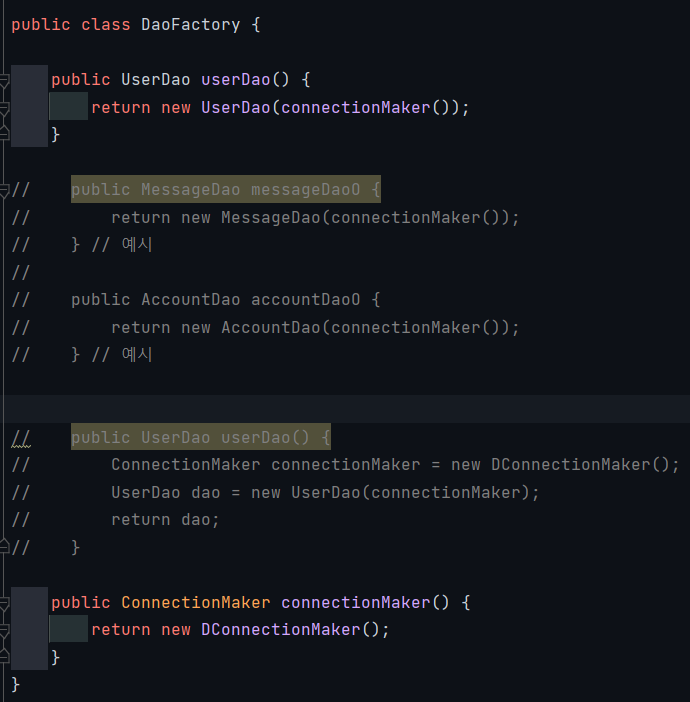

# 1.4 제어의 역전(loC)

## 1.4.1 오브젝트팩토리

> 이전에 했던 부분에 이상한 부분이 있다.
>
> < UserDaoTest >  
> 원래는 Test 용도인데, 어떤 ConnectionMaker 구현 클래스를 사용할지 결정하는 역할도 하고 있음

### (1) 팩토리

- 팩토리
    - 객체의 생성방법을 결정하고 그렇게 만들어진 오브젝트를 돌려준다
    - 추상팩토리 패턴, 팩토리메소드 패턴과는 무관

- 책임 분석
    - UserDao: 데이터 로직에 대한 책임
    - ConnectionMaker: DB 연결 기술에 대한 책임
    - DaoFactory: 오브젝트를 구성하고 관계를 정의하는 책임
    - UserDaoTest: 동작을 테스트하는 책임

- 여기서 UserDao, ConnectionMaker는 실질적인 로직을 담당하는 컴포넌트
- DaoFactory는 컴포넌트의 구조와 관계를 정의한 설계도 같은 역할

## 1.4.2 오브젝트 팩토리의 활용

- 만약 다양한 Dao가 생성된다면?

## 1.4.3 제어권의 이전을 통한 제어관계 역전

- 제어의 역전이란?
    - 프로그램의 제어흐름 구조가 뒤바뀌는 것
    - 일반적 흐름
        - main() 메소드에서 시작 - 다음 사용할 오브젝트 결정 - 결정한 오브젝트 생성 - 만들어진 오브젝트의 메서드 호출 등등
