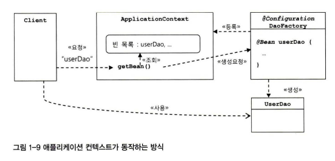

# 1.5 스프링의 IoC

- 스프링의 핵심을 담당하는 건, '빈 팩토리' 또는 '애플리케이션 컨텍스트'
    - (앞서 만든 'DaoFactory'가 하는 일을 일반화 한 것)

## 1.5.1 오브젝트 팩토리를 이용한 스프링 IoC

### 애플리케이션 컨텍스트와 설정정보

- 빈 bean
    - (여기서는 스프링 빈)
        - 스프링의 제어권을 가지고 직접 만들고 관계를 부여하는 오브젝트
        - 오브젝트 단위의 애플리케이션 컴포넌트
        - 자바빈, EJB자바빈의 자바빈과 비슷함
    - 스프링 컨테이너가 생성과 관계설정, 사용등을 제어해주는 '저어의 역전'이 적용된 오브젝트


- 빈 팩토리 bean factory
    - IoC 오브젝트 : 빈의 생성과 관계설정같은 제어를 담당


- 애플리케이션 컨텍스트 application context
    - 빈 팩토리를 더 확장한 개념
    - IoC 방식을 따라 만들어진 빈 팩토리
    - (책에서는 빈 팩토리 = 애플리케이션 컨텍스트)
        - 빈 팩토리 : 빈 생성, 관계 설정 - IoC 기본 기능에 초점
        - 애플리케이션 컨텍스트 : 애플리케이션 전반에 걸쳐 모든 구성요소의 제어 작업을 담당하는 IoC 엔진이라는 의미에 초점
    - 하는 일
        1. 빈(오브젝트) 생성
        2. 관계설정 - 제어 작업


- 애플리케이션은 애플리케이션 컨텍스트와 그 설정정보를 따라서 만들어지고 구성됨

### DaoFacotry를 사용하는 애플리케이션 컨텍스트

- DaoFactory를 스프링의 빈 팩토리가 사용할 수 있는 '설정정보'로 만들기
    - (1) @Configuration 어노테이션 추가
        - 스프링이 빈 팩토리를 위한 오브젝트 설정을 담당하는 클래스라고 인식
    - (2) 오브젝트 만들어주는 메소드에 @Bean 어노테이션 추가


- 이 두가지 어노테이션만으로 스프링 프레임워크의 빈팩토리가 IoC방식의 기능 제공할 때 사용할 완벽한 '설정정보'가 됨
    - Applicationcontext를 구현한 클래스는 여러 가지가 있는데 @Configuration이 붙은 자바 코드를 설정정보로 사용하려면
    - 'AnnotationConfigApplicationContext'를 이용!

```java
public class UserDaoTest {
    public static void main(String[] args) throws ClassNotFoundException, SQLException {
        Applicationcontext context =
                new AnnotationConfigApplicationContext(DaoFactory.class);
        UserDao dao = context.getBean("userDao“, UserDao.class);
    }
```

- getBean() : ApplicationContext가 관리하는 오브젝트를 요청하는 메소드
- "userDao" : getBean()의 파라미터, Applicationcontext에 등록된 빈의 이름

## 1.5.2 애플리케이션 컨텍스트의 동작방식



- 애플리케이션 컨텍스트는 Applicationcontext 인터페이스를 구현
- Applicationcontext는 빈 팩토리가 구현하는 BeanFactory 인터페이스를 상속
- 그러므로 애플리케이션 컨텍스트는 일종의 빈 팩토리
- 애플리케이션 컨텍스트가 스프링의 가장 대표적인 오브젝트
    - 그래서 애플리케이션 컨텍스트 자체를 스프링이라고도 부르기도 함

### 애플리케이션 컨텍스트를 사용했을 때 얻을 수 있는 장점

- DaoFactory를 오브젝트 팩토리로 직접 사용했을 때와 비교해서 애플리케이션 컨텍스트를 사용했을 때 얻을 수 있는 장점

1.

### 오브젝트 팩토리 이용 방식 vs 스프링 애플리케이션 컨텍스트 방식 '비교'

- 오브젝트 팩토리 == 애플리케이션 컨텍스트 (IoC컨테이너, 스프링 컨테이너, 빈 팩토리)

- 애플리케이션 컨텍스트는 ApplicationContext 인터페이스 구현
- ApplicationContext는 BeanFactory 인터페이스를 상속했으므로 애플리케이션 컨텍스트는 일종의 '빈 팩토리'

## 1.5.3 스프링 IoC의 용어 정리
