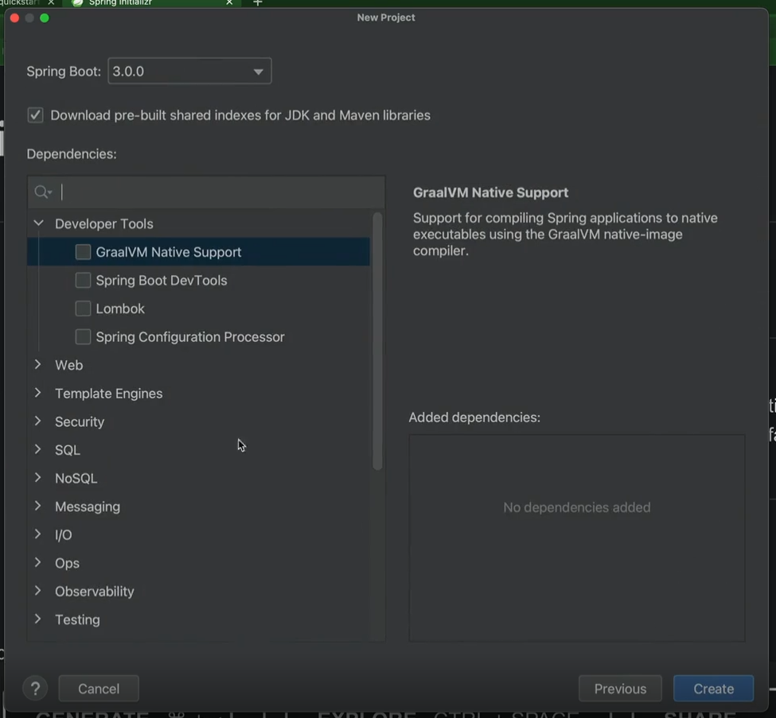
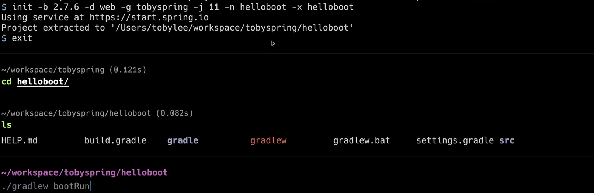
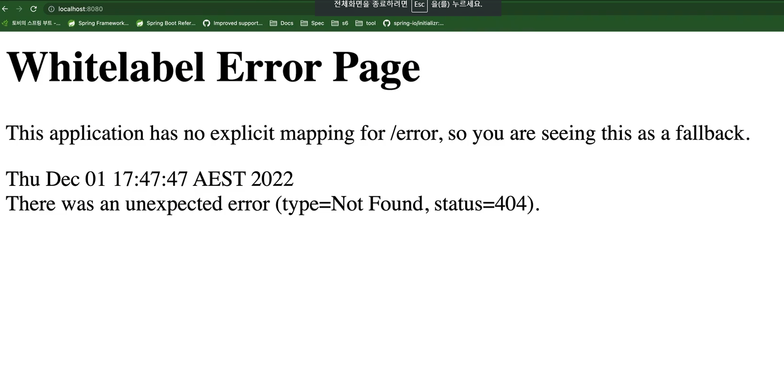
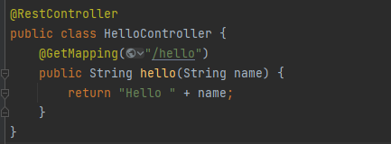
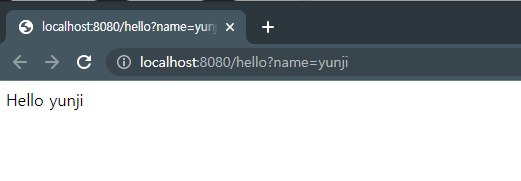
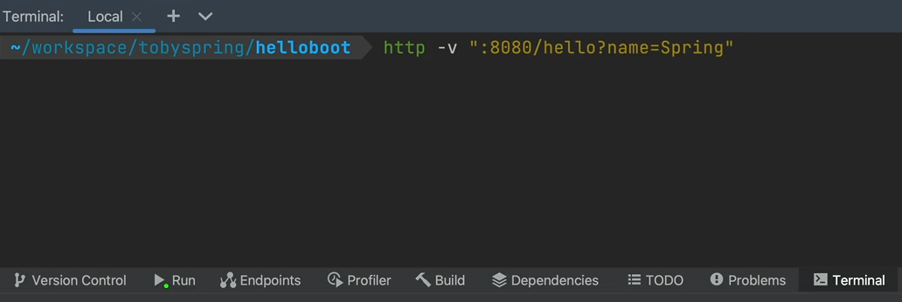
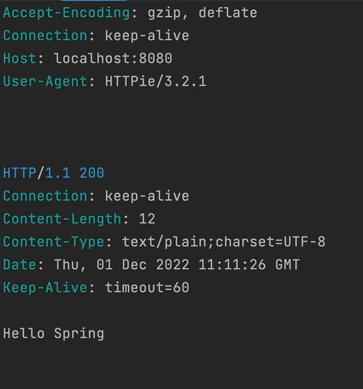
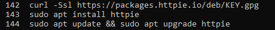
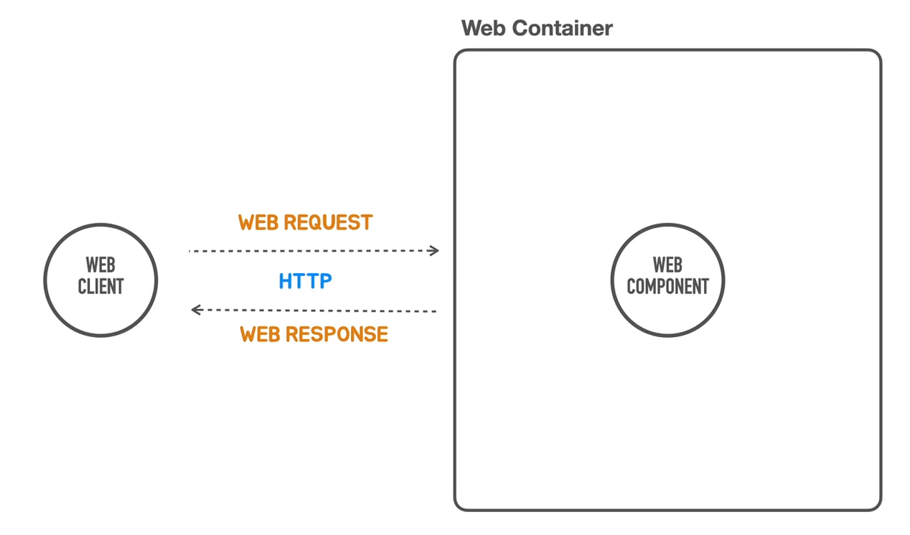

# 섹션 2. 프로젝트 생성 및 간단한 API 테스트

## 1. 개발 환경 준비

### spring boot

- spring boot 2.7.6 버전

### jdk

- jdk 8, 11, 17 설치

- jdk 설치 매니저
    - sdk man
        - 디폴트로 어떤 jdk 버전 사용할지 결정
        - 프로젝트 마다 버전 관리도 가능
    - jabba

### IDE (통합개발환경)

- intellij idea
- sts
- vs code
- spring boot CLI - 커맨드라인 사용

## 2. 프로젝트 생성

### spring initializr

- 스프링 부트 템플릿 만드는 사이트



### 커맨드창에서 실행



- init
    - -b 버전
    - -d 디펜던시
    - -g 그룹 이름
    - -j jar
    - -n 프젝 이름
    - -x 어떤 이름으로 압축 풀건지



- 스프링이 뿌려주는 디폴트 페이지
- 톰캣 서버 정상 작동

## 3. Hello Controller

### Controller

- 웹 컨테이너에서 웹 컴포넌트처럼 웹의 요청을 받아서 결과 리턴함




## 4. Hello API Test

- hello() 컨트롤러 메소드를 호출할 수 있는 HTTP Request를 생성하고 리턴되는 HTTP Response를 확인
- HTTP 요청만들고 응답 확인하는 도구
    - 웹 브라우저 개발자 도구
    - curl
    - HTTPie
    - Intellij IDEA Ultimate- http request
    - Postman API Platform
    - JUnit Test
    - 각종 API 테스트 도구

### Intellij IDEA - http reqeust 활용해서 테스트하기

- 명령어



- 콘솔 결과



- 요청라인, 헤더 (바디)
- 응답라인, 헤더
- 바디

### 직접 windows용 linux에 설치해보기



## 5. Http 요청과 응답

### http

- 어떻게 요청과 응답을 할 것인가에 대한 표준기술, 프로토콜



- 웹 Request와 Response의 기본 구조를 이해하고 내용을 확인할 수 있어야 한다

### Request

- Request Line: Method, Path, HTTP Version
- Headers
- Message Body

### Response

- Status Line: HTTP Version, Status Code, Status Text
- Headers
- Message Body

```json
❯ http -v ":8080/hello?name=Spring"
GET /hello?name=Spring HTTP/1.1 // 경로, http 버전
Accept: */* // 컨텐츠의 타입 지정
Accept-Encoding: gzip, deflate
Connection: keep-alive
Host: localhost: 8080
User-Agent: HTTPie/3.2.1

HTTP/1.1 200 // 코드
Connection: keep-alive
Content-Length: 12
Content-Type: text/plain;charset=UTF-8 // 아래의 바디가 어떻게 인코딩되는가
Date: Thu, 01 Dec 2022 01: 45: 15 GMT
Keep-Alive: timeout=60

Hello Spring // 바디

```