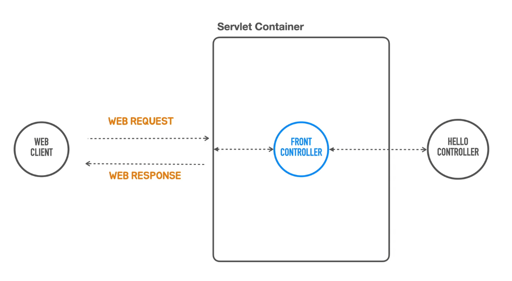
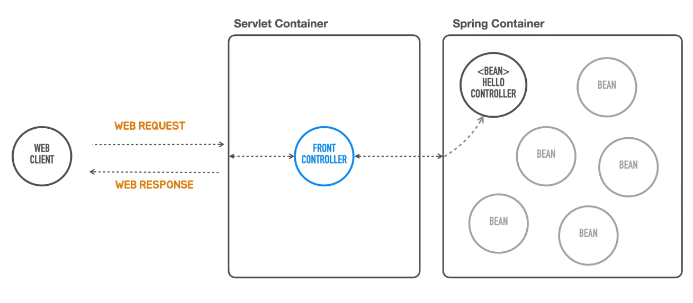
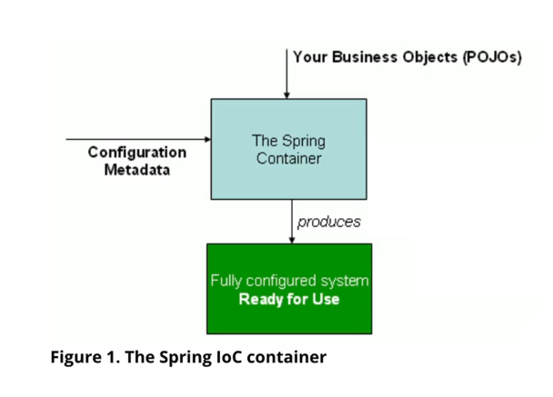
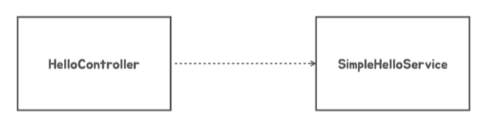
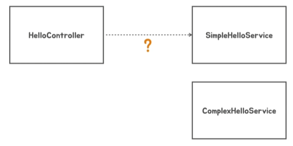
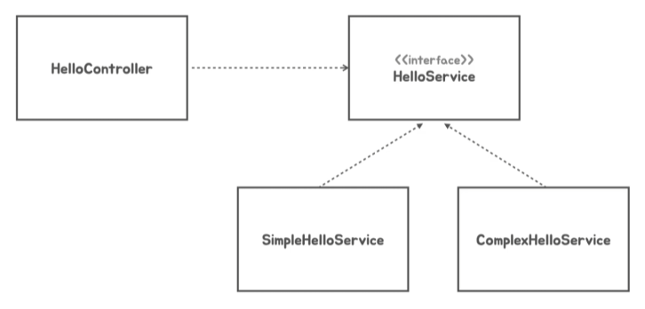
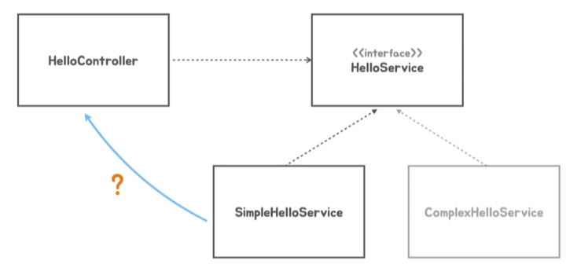
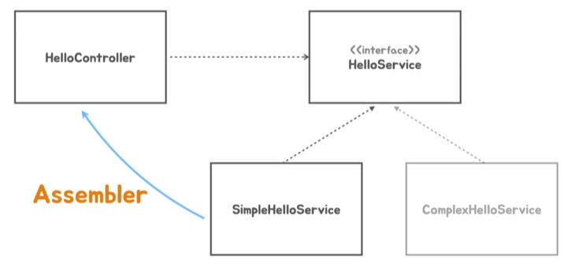
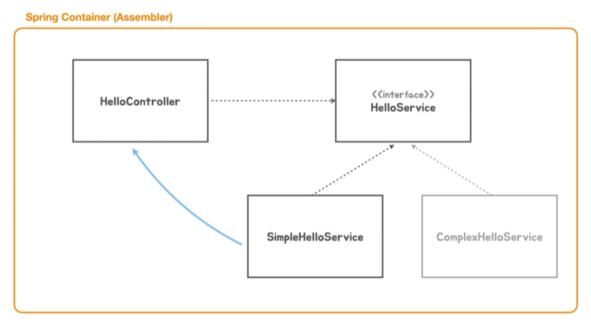
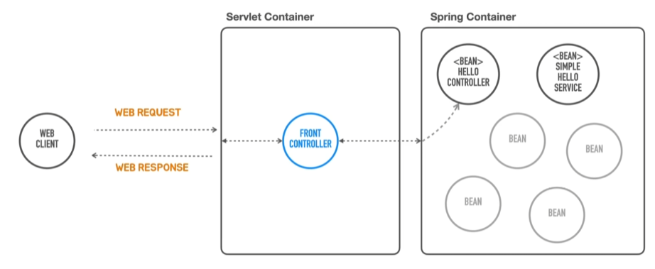

# 4. 독립 실행형 스프링 애플리케이션

### (1) 서블릿 컨테이너



### (2) 스프링 컨테이너





- 작동방식
    - 비즈니스 로직을 담고있는 비즈니스 오브젝트 'POJOs' - 평범한 자바 오브젝트와
    - 애플리케이션 설정방식에 대한 정보 - configuration metadata를
    - '스프링 컨테이너' 가 조합을 해서
    - 사용가능한 완전히 구성된 서버 어플리케이션을 만든다

## 스프링 컨테이너를 사용하는 방식으로 구현

```java
public class SpringbootApplication {

    public static void main(String[] args) {

        // 스프링 애플리케이션 컨텍스트가 결국은 '스프링 컨테이너'가 된다
        // 쉽게 구현할 수 있도록 해주는 거 -> GenericApplicationContext
        GenericApplicationContext applicationContext = new GenericApplicationContext();
        applicationContext.registerBean(HelloController.class); // 빈 등록 - 보통 이렇게 클래스 이름 명시
        applicationContext.refresh(); // 컨테이너 초기화 - applicationContext이 빈 오브젝트 다 만들어준다

        ServletWebServerFactory serverFactory = new TomcatServletWebServerFactory();
        WebServer webServer = serverFactory.getWebServer(servletContext -> {

            servletContext.addServlet("hello", new HttpServlet() {
                @Override
                protected void doGet(HttpServletRequest req, HttpServletResponse resp) throws ServletException, IOException {
                    // 인증, 보안, 다국어, 공통기능
                    if (req.getRequestURL().equals("/hello") && req.getMethod().equals(HttpMethod.GET.name())) {
                        String name = req.getParameter("name");

                        HelloController helloController = applicationContext.getBean(HelloController.class); // 만든 빈 가져오기
                        String ret = helloController.hello(name);

                        resp.setContentType(MediaType.TEXT_PLAIN_VALUE);
                        resp.getWriter().println(ret);
                    } else {
                        resp.setStatus(HttpStatus.NOT_FOUND.value());
                    }
                }
            }).addMapping("/*");

        });
        webServer.start();
    }
}

```

## 스프링 컨테이너 == 싱글톤 레지스트리

- 싱글톤 패턴
    - 한번 오브젝트를 만들고 그걸 계속 재사용하는 것
- 스프링
    - 한번 등록한 오브젝트를 새롭게 생성하는게 아니고 매번 같은걸 리턴
    - 그래서 스프링 컨테이너를 '싱글톤 레지스트리'라고 한다
        - 싱글톤 패턴을 사용하는건 아니지만 재사용은 같으니까!

```java
public class HelloController {

    public String hello(String name) {
        SimpleHelloService helloService = new SimpleHelloService();

        return helloService.sayHello(Objects.requireNonNull(name));
        // 컨트롤러는 유저의 요청사항 검증해야한다
        // null이면 에러 내보내고 null이 아니면 값을 전달
    }
}
```

## DI (Dependency Injection)
- 보통 스프링 컨테이너를 Spring IoC/DI Contatiner 라고도 한다



- SimpleHelloService 클래스에 HelloController 클래스는 영향을 받고 있다.
  - = 즉 의존관계를 가지고 있다



- 그럼 만약에 이 SimpleHelloService 클래스말고 새로운 ComplexHelloService 를 사용하려면?
  - HelloController의 코드를 수정해야한다!

- 독립적인 코드로 만들려면 어떻게 해야하지?



- 위와 같은 방식으로 하게되면 HlloService 인터페이스에서 정해주기만 하면 되니까 어떤 Service를 사용하던지 HelloController는 영향 받지 않을 수 있다





- 그런데 이제 HelloController가 실행할 때 둘 중에 어떤 서비스를 이용해야할지 모르니까 어떻게든 연관 관계는 필요하게된다
- 이떄의 과정을 이제 **'Dependency Injection'** 이라고 한다!
  - DI는 제3의 존재가 필요하고 이걸 바로 'Assembler'라고 함
  - 소스코드상에서는 연결되어있지 않지만 컨트롤러에서 서비스를 사용하려면 그 서비스 오브젝트를 주입시켜주어야 한다
  - 이 어셈블러를 우리는 '스프링 컨테이너'라고 함



- 즉, 스프링 컨테이너가 하는 일이 뭐냐 !!
  - 우리가 메타정보를 전달해주면 클래스에 싱글톤 오브젝트를 만드는데, 
  - 이 오브젝트를 사용할 다른 의존 오브젝트가 있다면
  - 그 오브젝트를 '주입'해준다


- 주입방법
  - 생성자를 통해서 주입
  - 팩토리 메소드를 통해 빈을 만들어서 파라미터를 넘김

## DI (Dependency Injection) 적용해보기!



```java
public interface HelloService {
    String sayHello(String name);
}
```

```java
public class SimpleHelloService implements HelloService {
    @Override
    public String sayHello(String name) {
        return "Hello " + name;
    }
}
```

```java
public class HelloController {

    private final HelloService helloService;

    public HelloController(HelloService helloService) {
        this.helloService = helloService;
    }
    // final : 한번 할당되면 이후에 재할당 불가

    public String hello(String name) {
        return helloService.sayHello(Objects.requireNonNull(name));
        // 컨트롤러는 유저의 요청사항 검증해야한다
        // null이면 에러 내보내고 null이 아니면 값을 전달
    }
}
```

```java
public class SpringbootApplication {

    public static void main(String[] args) {

        // 스프링 애플리케이션 컨텍스트가 결국은 '스프링 컨테이너'가 된다
        // 쉽게 구현할 수 있도록 해주는 거 -> GenericApplicationContext
        GenericApplicationContext applicationContext = new GenericApplicationContext();
        applicationContext.registerBean(HelloController.class); // 빈 등록 - 보통 이렇게 클래스 이름 명시
        applicationContext.registerBean(SimpleHelloService.class); // 빈 등록 - 보통 이렇게 클래스 이름 명시
        // 여기에서는 그냥 HelloService라고 하면 안됨. 인터페이스니까. 보통 빈 등록하려면 정확하게 구체화된 클래스 이름을 명시해야함

        applicationContext.refresh(); // 컨테이너 초기화 - applicationContext이 빈 오브젝트 다 만들어준다

        ServletWebServerFactory serverFactory = new TomcatServletWebServerFactory();
        WebServer webServer = serverFactory.getWebServer(servletContext -> {

            servletContext.addServlet("hello", new HttpServlet() {
                @Override
                protected void doGet(HttpServletRequest req, HttpServletResponse resp) throws ServletException, IOException {
                    // 인증, 보안, 다국어, 공통기능
                    if (req.getRequestURL().equals("/hello") && req.getMethod().equals(HttpMethod.GET.name())) {
                        String name = req.getParameter("name");

                        HelloController helloController = applicationContext.getBean(HelloController.class); // 만든 빈 가져오기
                        String ret = helloController.hello(name);

                        resp.setContentType(MediaType.TEXT_PLAIN_VALUE);
                        resp.getWriter().println(ret);
                    } else {
                        resp.setStatus(HttpStatus.NOT_FOUND.value());
                    }
                }
            }).addMapping("/*");

        });
        webServer.start();
    }
}
```

## DispatcherServlet 으로 전환
- dispathcerServlet
  - front controller의 많은 기능을 대신해주는 서블릿
- 스프링 컨테이너와 연결은 어떻게 해야할까? 
