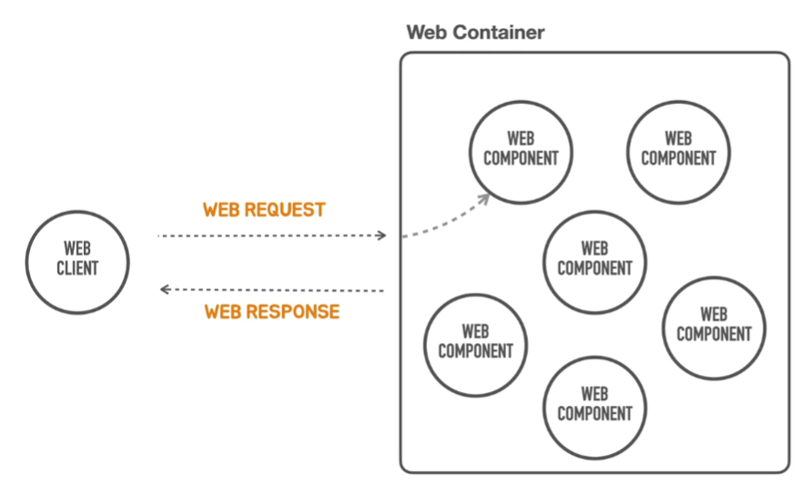
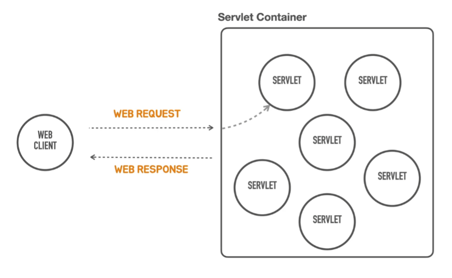
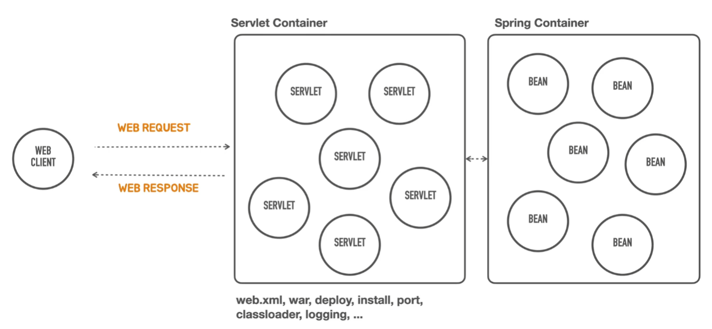
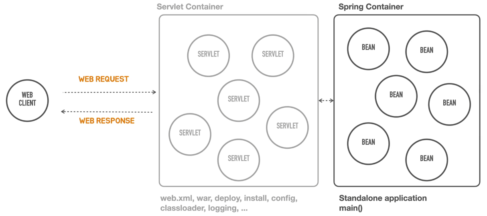
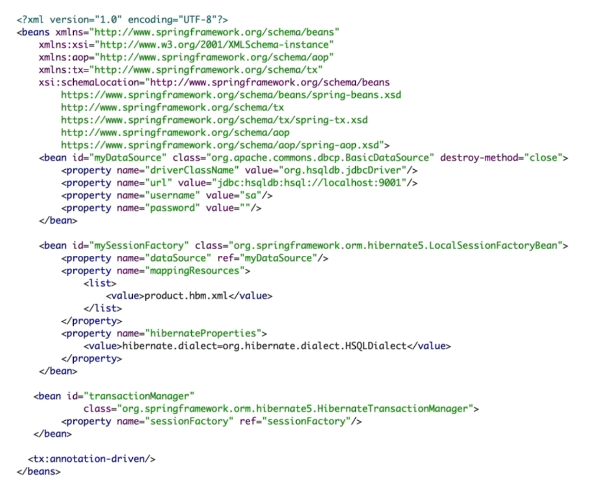

# 1.1 스프링부트 소개

## (1) 스프링 부트가 뭔데?

- 스프링부트는 스프링을 기반으로 실무 환경에 사용 가능한 수준의 독립실행형 애플리케이션을 '빠르게 작성할 수 있게' 도와주는 여러가지 도구의 모음
- 스프링 ≠ 스프링 부트
- 빠르게 만들 수 있음 -> 이미 결정되어져 있음 -> 본격적으로 대규모 서비스로 개발할때는 단점이 존재할 수 있음

## (2) 스프링 부트 특징

1. 매우 빠르고 광범위한 영역의 스프링 개발 하게 해준다
2. 강한 주장을 가지고 즉시 적용 가능한 기술 제공 + 원하는 방식으로 변형 가능
3. 프로젝트에 필요한 다양한 비기능적인 기술(내장형 서버, 보안, 메트릭, 상태 체크, 외부 설정 방식 등) 제공
4. 코드 생성이나 XML 설정을 불필요
    - 일반적인 스프링은 xml을 통해서 설정을 해야했음

## (3) 스프링 부트 역사

- 2012년 스프링 프레임워크 프로젝트에 [이슈](https://github.com/spring-projects/spring-framework/issues/14521) 로 등록된 'Containerless 웹 개발
  아키텍처의 지원' 요청에서 논의와 개발 시작
    - 알아야 할 개념 지식들이 너무 많아서 진입장벽이 높았음
    - 그래서 이 문서상에서 요구사항들을 작성함
    - 스프링을 개선하기보다는 다같이 새로운 프젝 '스프링부트'를 만듬
    - 0.5.0.M1에 첫 배포

## (4) Containerless

### containerless란?

- Container
    - 스프링은 IoC 컨테이너
    - 웹 클라이언트가 웹 컴포넌트에게 요청을 한다
    - 웹 컴포넌트는 무슨 일을 해?
        - dynamic content를 만든다
            - 다이나믹하게 바뀌는 동적 콘텐츠
        - 서버에서 작동하는 서비스 등등
    - 그리고 웹 컴포넌트는 웹 클라이언트에게 응답
    - 웹 컴포넌트는 혼자 있을 수 없고, 꼭 웹 컨테이너(web container) 안에 있어야 함
        - 웹 컴포넌트 혼자 작동하는게 아니고
        - 무언가가 시작시켜주고, 컴포넌트를 메모리에 올려주어야하고, 인스턴스 생성해주고 등등 이런 관리를 해주는게 웹 컨테이너
            - 그리고 컨테이너는 하나의 컴포넌트만 가지고 있는게 여러 개가 있고 그걸 다 관리해준다
            - 클라이언트에서 요청이 오면 그게 어떤 컴포넌트랑 연결해야하는지도 파악해서 넘겨줌 (라우팅, 핸들러매핑)

### Servlet Container

- 위에서 여기에서 보여지는 웹 컨테이너를 자바에서는 'Servlet Container'라고 함, 컴포넌트는 'Servlet'으로!
    - Servlet Container 의 예로는 'Tomcat'이 있음!!
    - 여기에 서블릿들을 여러개 넣고, 매핑정보를 넣으면
    - 서블릿 컨테이너에서 클라이언트 요청과 서블릿을 연결해준다

### Spring framework

- 그리고 이러한 서블릿에 불만족한 사람들이 만든 게 'spring framework'
- 서블릿 컨테이너가 스프링으로 바뀐게 아니고 서블릿컨테이너 뒤에 스프링 컨테이너가 들어가게 된다
- 서블릿이랑 bean이랑 또 매핑해서 로직 처리
- 근데 왜 아예 스프링 컨테이너랑 대체할 수 없는가?
    - 자바의 표준 웹 기술을 사용하려면 서블릿 컨테이너가 필요하긴 함

- 그런데 스프링 개발할 때 이 '스프링 컨테이너'에만 신경쓰고 싶은데, 프로그램을 동작시키려면 서블릿도 어찌되었든 설정을 잡거나 해야함
    - 설정방식 어려움
        - web.xml 등의 파일에서
        - 루트컨텍스트, 서블릿 매핑, 리스너 등등 설정 필요
        - war, deploy(배포 설정), install. port, classloader, logging 등의 설정도 잡아야 함

### Spring Boot

- 그래서 나온게 'spring boot (스프링 부트)'
- containerless가 적용되면 위에 어렵고 복잡한 servlet container 설정들을 안 잡아도 된다
- 말처럼 컨테이너가 사라졌다는게 아니고
- 그냥 미리 정해져있는거라고 생각하면 됨
- 스프링부트에서 main() 메소드 호출해주면 서비스가 작동이 처음 시작된다
    - 이게 바로 '독립실행형 애플리케이션'

### 정리 : 스프링부트 나온 이유

- 스프링 애플리케이션 개발에 요구되는 서블릿 컨테이너의 설치, WAR 폴더 구조, web.xml, WAR 빌드, 컨테이너로 배치, 포트 설정, 클래스로더, 로깅 등과 같은, 필요하지만 애플리케이션 개발의 핵심이
  아닌 단순 반복 작업을 제거해주는 개발 도구와 아키텍처 지원
- 설치된 컨테이너로 배포하지 않고 독립실행형(standalone) 자바 애플리케이션으로 동작

## (5) Opinionated

### 스프링 프레임워크 설계 철학

1. 극단적 유연함 추구
2. 다양한 관점 수용
3. Not Opinionated
4. 수많은 선택지 포용 (오픈소스 등)

=> 단점 : 이런 세세한 설정 모두 개발자가 해야 함

### 특징 : opinionated

- "내가 다 정해줄게 일단 개발만 해"
- Opinionated : 자기 의견을 고집하는, 독선적인, 자기주장이 강한.
- 스프링을 잘 활용하는 뛰어난 방법 제공

### 스프링 부트가 정해주는 것은?

- 사용기술과 의존 라이브러리 결정
    - 업계에서 검증된 스프링 생태계 프로젝트, 표준 자바 기술, 오픈 소스 기술의 종류와 의존관계, 사용버전을 정해줌
    - 각 기술을 스프링에 적용하는 방식 (DI 구성 - 빈 설정하는 방식)과 디폴트 설정값 제공
        - 원래 설정 잡아줘야하는 부분 중
          

- 유연한 확장
    - 스프링 부트에 내장된 디폴트 구성을 커스토마이징하는 매우 자연스럽고 유연한 방법 제공
    - '스프링 부트가 스프링 사용 방식을 이해'한다면 언제라도 스프링 부트 제거하고 원하는 방식 재구성 가능
    - 스프링 부트처럼 기술과 구성을 간편하게 제공하는 나만의 모듈 작성

## (6) 스프링 부트의 이해

### 스프링 부트를 이용한 개발 방법

1. 부트가 결정한 기술, 구성, 디폴트 설정 수용
2. 외부 설정 파일을 이용한 설정 변경 방법 활용
3. 빠르게 개발 시작 가능

### 단점

- 스프링 부트가 어떻게, 무엇을 제공하는지를 잘 모르면 작은 기술적인 요구 변화에도 문제 해결 어려움
- 시스템의 발전에 따른 다양한 요구를 수용하기 어려움

> "프레임워크를 효과적으로 재사용하기 위해서는 프레임워크의 최종 모습뿐만 아니라 현재의 모습을 띠게 되기까지 진화한 과정을 살펴 보는 것이 가장 효과적이다.
> 프레임워크의 진화 과정 속에는 프레임워크의 구성 원리 및 설계 원칙, 재사용 가능한 컨텍스트와 변경 가능성에 관련 된 다양한 정보가 들어 있기 때문이다.“
>
> 조영호 (프레임워크 3부)