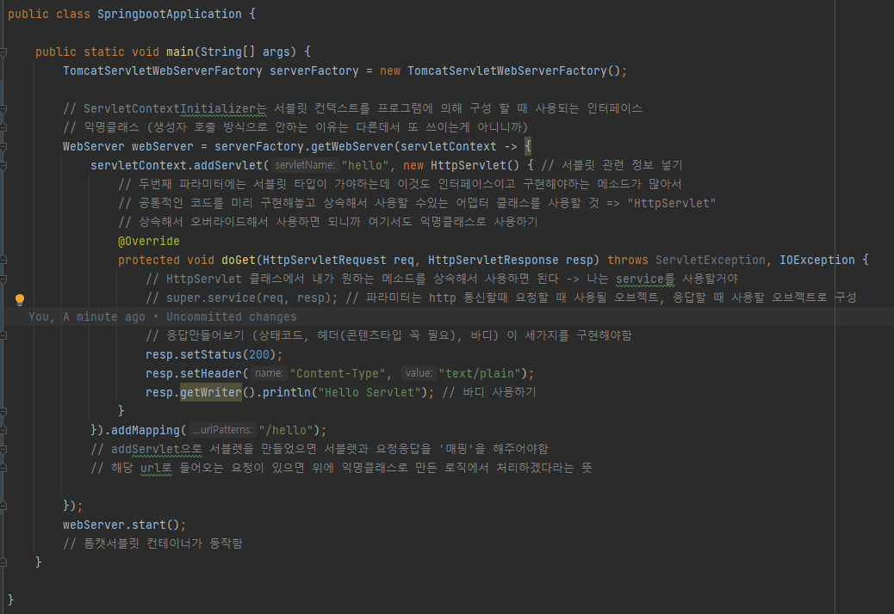

# 3. 독립 실행형 서블릿 애플리케이션

## (1) Containerless 개발준비

- Containerless : 서블릿 컨테이너 설정에 신경쓰지 말자!


- 이전까지 했던걸 보면 아래와 같이 간단하게 컨트롤러만 만들었을 뿐인데 실행하는걸 보면 톰캣이 자동으로 실행되고, 잘 뜨는 것을 볼 수 있다


- 스프링과 관련된 설정을 하지도 않았는데 이 컨트롤러가 스프링 컨테이너에 올라갔다 (동작시킬 수 있었다)


- @SpringBootApplication 어노테이션과 main() 메소드의 run 이 두 개로 작동시킬 수 있다

### 그렇다면, 이 스프링부트의 속성을 빼고 원래 스프링이 하던 방식으로 하면 어떤 과정을 거쳐야할까?


- 어노테이션과 run 함수를 삭제했더니
    - 서버는 연결되지 않았지만
    - main() 는 실행된 것을 확인할 수 있었음

> 그럼 이제부터 천천히 스프링의 서블릿 컨테이너를 구현해보자 !!

## (2) 서블릿 컨테이너 띄우기


### 빈 서블릿 컨테이너를 만들어보자!

- 서블릿은 자바의 표준 기술이고
- 컨테이너는 종류가 무척 많은데
- 그 중 가장 잘 사용되는 '톰캣'을 사용할 것 !
- 톰캣을 가져다가 main 메소드를 시작하려고 한다
    - 톰캣을 어떻게 설치할 수 있고 사용할 수 있을까??
        - 톰캣도 자바로 만들어진 프로그램
        - 톰캣도 임베디드 톰캣(내장형톰캣)이라는 안에 넣어서 사용할 수 있는 라이브러리 제공해줌
        - 스프링부트 만들면 자동적으로 톰캣이 내장되어 있다!

### 톰캣 띄우기


- 자바에는 톰캣서버를 띄울수 있도록 도와주는 클래스가 있음
    - => 'TomcatServletWebServerFactory'
    - 이걸 이용해서 웹서버를 시작한다

### 결과


## (3) 서블릿 등록


- Http 통신을 위해서 서블릿 등록하고 매핑하는 작업이 필요하다

### 요청과 응답


### 코드



```java
public class SpringbootApplication {

    public static void main(String[] args) {
        TomcatServletWebServerFactory serverFactory = new TomcatServletWebServerFactory();

        // ServletContextInitializer는 서블릿 컨텍스트를 프로그램에 의해 구성 할 때 사용되는 인터페이스
        // 익명클래스 (생성자 호출 방식으로 안하는 이유는 다른데서 또 쓰이는게 아니니까)
        WebServer webServer = serverFactory.getWebServer(servletContext -> {
            servletContext.addServlet("hello", new HttpServlet() { // 서블릿 관련 정보 넣기
                // 두번째 파라미터에는 서블릿 타입이 가야하는데 이것도 인터페이스이고 구현해야하는 메소드가 많아서
                // 공통적인 코드를 미리 구현해놓고 상속해서 사용할 수있는 어뎁터 클래스를 사용할 것 => "HttpServlet"
                // 상속해서 오버라이드해서 사용하면 되니까 여기서도 익명클래스로 사용하기
                @Override
                protected void doGet(HttpServletRequest req, HttpServletResponse resp) throws ServletException, IOException {
                    // HttpServlet 클래스에서 내가 원하는 메소드를 상속해서 사용하면 된다 -> 나는 service를 사용할거야
                    // super.service(req, resp); // 파라미터는 http 통신할때 요청할 때 사용될 오브젝트, 응답할 때 사용할 오브젝트로 구성

                    // 응답만들어보기 (상태코드, 헤더(콘텐츠타입 꼭 필요), 바디) 이 세가지를 구현해야함
                    resp.setStatus(200);
                    resp.setHeader("Content-Type", "text/plain");
                    resp.getWriter().println("Hello Servlet"); // 바디 사용하기
                }
            }).addMapping("/hello");
            // addServlet으로 서블렛을 만들었으면 서블렛과 요청응답을 '매핑'을 해주어야함
            // 해당 url로 들어오는 요청이 있으면 위에 익명클래스로 만든 로직에서 처리하겠다라는 뜻

        });
        webServer.start();
        // 톰캣서블릿 컨테이너가 동작함
    }

}
```

### 실행해보기


### 결과


## (4) 서블릿 요청 처리

- 위에서 작성한 코드를 리팩토링하기


- 하드코딩에서 적어둔 것들 스프링에서 제공하는 ENUM 사용해서 넣기
- 스프링 컨트롤러에서 구현했던 것처럼 파라미터 값을 받아와서 응답하기

### 코드

```java
public class SpringbootApplication {

    public static void main(String[] args) {
        TomcatServletWebServerFactory serverFactory = new TomcatServletWebServerFactory();
        WebServer webServer = serverFactory.getWebServer(servletContext -> {
            servletContext.addServlet("hello", new HttpServlet() {
                @Override
                protected void doGet(HttpServletRequest req, HttpServletResponse resp) throws ServletException, IOException {
                    String name = req.getParameter("name");

                    resp.setStatus(HttpStatus.OK.value());
                    resp.setHeader(HttpHeaders.CONTENT_TYPE, MediaType.TEXT_PLAIN_VALUE);
                    resp.getWriter().println("Hello " + name);
                }
            }).addMapping("/hello");

        });
        webServer.start();
    }
}
```

## (5) 프론트 컨트롤러

## (6) 프론트 컨트롤러로 전환

## (7) hello 컨트롤러 매핑과 바인딩